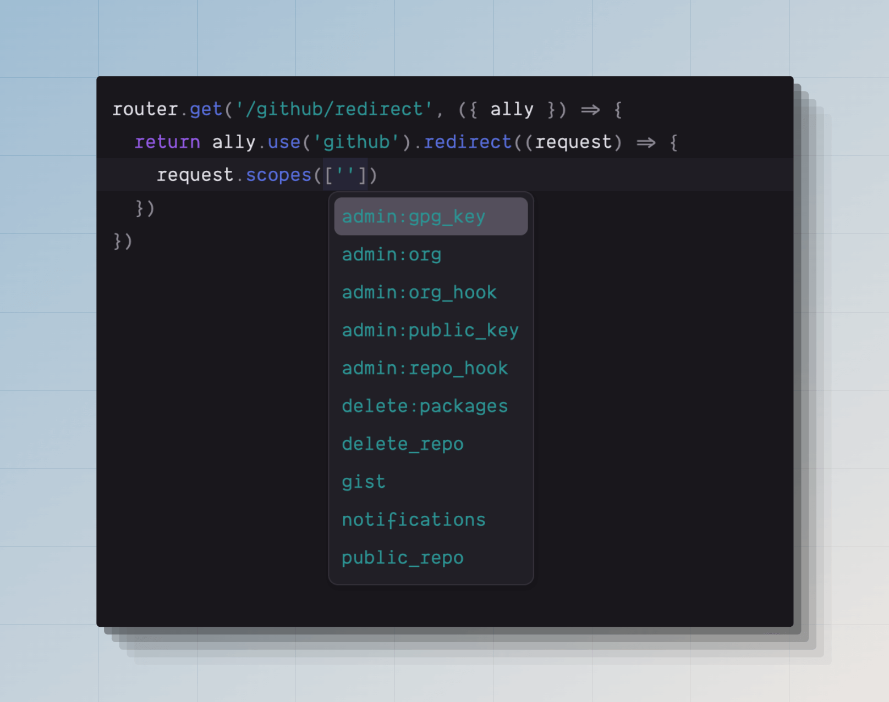

# 社交认证

您可以使用 `@adonisjs/ally` 包在您的 AdonisJS 应用程序中实现社交认证。Ally 提供了以下内置驱动程序，以及一个可扩展的 API 来[注册自定义驱动程序](#creating-a-custom-social-driver)。

- Twitter
- Facebook
- Spotify
- Google
- GitHub
- Discord
- LinkedIn

Ally 不会代表您存储任何用户或访问令牌。它实现了 OAuth2 和 OAuth1 协议，使用社交服务对用户进行身份验证，并提供用户详细信息。您可以将这些信息存储在数据库中，并使用 [auth](./introduction.md) 包在您的应用程序中登录用户。

## 安装

使用以下命令安装并配置该包：

```sh
node ace add @adonisjs/ally

# 以 CLI 标志的形式定义提供者
node ace add @adonisjs/ally --providers=github --providers=google
```

:::disclosure{title="查看 add 命令执行的步骤"}

1. 使用检测到的包管理器安装 `@adonisjs/ally` 包。

2. 在 `adonisrc.ts` 文件中注册以下服务提供者。

    ```ts
    {
      providers: [
        // ...其他提供者
        () => import('@adonisjs/ally/ally_provider')
      ]
    }
    ```

3. 创建 `config/ally.ts` 文件。该文件包含所选 OAuth 提供者的配置设置。

4. 定义环境变量以存储所选 OAuth 提供者的 `CLIENT_ID` 和 `CLIENT_SECRET`。

:::

## 配置

`@adonisjs/ally` 包的配置存储在 `config/ally.ts` 文件中。您可以在单个配置文件中为多个服务定义配置。

另请参阅：[配置存根](https://github.com/adonisjs/ally/blob/main/stubs/config/ally.stub)

```ts
import { defineConfig, services } from '@adonisjs/ally'

defineConfig({
  github: services.github({
    clientId: env.get('GITHUB_CLIENT_ID')!,
    clientSecret: env.get('GITHUB_CLIENT_SECRET')!,
    callbackUrl: '',
  }),
  twitter: services.twitter({
    clientId: env.get('TWITTER_CLIENT_ID')!,
    clientSecret: env.get('TWITTER_CLIENT_SECRET')!,
    callbackUrl: '',
  }),
})
```

### 配置回调 URL

OAuth 提供者要求您注册一个回调 URL，以处理用户授权登录请求后的重定向响应。

回调 URL 必须在 OAuth 服务提供者处注册。例如：如果您使用的是 GitHub，您必须登录您的 GitHub 帐户，[创建一个新应用](https://docs.github.com/en/apps/oauth-apps/building-oauth-apps/creating-an-oauth-app)，并使用 GitHub 界面定义回调 URL。

同时，您必须使用 `callbackUrl` 属性在 `config/ally.ts` 文件中注册相同的回调 URL。

## 使用

配置好包后，您可以使用 `ctx.ally` 属性与 Ally API 进行交互。您可以使用 `ally.use()` 方法在配置的认证提供者之间进行切换。例如：

```ts
router.get('/github/redirect', ({ ally }) => {
  // GitHub 驱动程序实例
  const gh = ally.use('github')
})

router.get('/twitter/redirect', ({ ally }) => {
  // Twitter 驱动程序实例
  const twitter = ally.use('twitter')
})

// 您还可以动态检索驱动程序
router.get('/:provider/redirect', ({ ally, params }) => {
  const driverInstance = ally.use(params.provider)
}).where('provider', /github|twitter/)
```

### 重定向用户进行认证

社交认证的第一步是将用户重定向到 OAuth 服务，并等待他们批准或拒绝认证请求。

您可以使用 `.redirect()` 方法执行重定向。

```ts
router.get('/github/redirect', ({ ally }) => {
  return ally.use('github').redirect()
})
```

您可以传递一个回调函数，在重定向期间定义自定义范围或查询字符串值。

```ts
router.get('/github/redirect', ({ ally }) => {
  return ally
    .use('github')
    .redirect((request) => {
      // highlight-start
      request.scopes(['user:email', 'repo:invite'])
      request.param('allow_signup', false)
      // highlight-end
    })
})
```

### 处理回调响应

用户在批准或拒绝认证请求后，将被重定向回您应用程序的 `callbackUrl`。

在该路由中，您可以调用 `.user()` 方法获取已登录用户的详细信息和访问令牌。但是，您还必须检查响应中是否存在可能的错误状态。

```ts
router.get('/github/callback', async ({ ally }) => {
  const gh = ally.use('github')

  /**
   * 用户通过取消登录流程拒绝了访问
   */
  if (gh.accessDenied()) {
    return 'You have cancelled the login process'
  }

  /**
   * OAuth 状态验证失败。这通常发生在 CSRF cookie 过期时。
   */
  if (gh.stateMisMatch()) {
    return 'We are unable to verify the request. Please try again'
  }

  /**
   * GitHub 返回了一些错误
   */
  if (gh.hasError()) {
    return gh.getError()
  }

  /**
   * 访问用户信息
   */
  const user = await gh.user()
  return user
})
```

## 用户属性

以下是从 `.user()` 方法调用返回值中可以访问的属性列表。这些属性在所有底层驱动程序中是一致的。

```ts
const user = await gh.user()

user.id
user.email
user.emailVerificationState
user.name
user.nickName
user.avatarUrl
user.token
user.original
```

### id

OAuth 提供者返回的唯一 ID。

### email

OAuth 提供者返回的电子邮件地址。如果 OAuth 请求未要求用户的电子邮件地址，则该值将为 `null`。

### emailVerificationState

许多 OAuth 提供者允许使用未验证的电子邮件的用户登录并认证 OAuth 请求。您应使用此标志确保只有电子邮件已验证的用户才能登录。

以下是可能的值列表：

- `verified`：用户的电子邮件地址已在 OAuth 提供者处验证。
- `unverified`：用户的电子邮件地址未验证。
- `unsupported`：OAuth 提供者不共享电子邮件验证状态。

### name

OAuth 提供者返回的用户姓名。

### nickName

用户的公开可见昵称。如果 OAuth 提供者没有昵称的概念，则 `nickName` 和 `name` 的值将相同。

### avatarUrl

用户公开头像图片的 HTTP(s) URL。

### token

token 属性是对底层访问令牌对象的引用。令牌对象具有以下子属性：

```ts
user.token.token
user.token.type
user.token.refreshToken
user.token.expiresAt
user.token.expiresIn
```

| 属性 | 协议 | 描述 |
|---------|------------|------------|
| `token` | OAuth2 / OAuth1 | 访问令牌的值。该值适用于 `OAuth2` 和 `OAuth1` 协议。 |
| `secret` | OAuth1 | 仅适用于 `OAuth1` 协议的令牌密钥。目前，Twitter 是唯一使用 OAuth1 的官方驱动程序。 |
| `type` | OAuth2 | 令牌类型。通常，它将是 [bearer token](https://oauth.net/2/bearer-tokens/)。 |
| `refreshToken` | OAuth2 | 您可以使用刷新令牌创建新的访问令牌。如果 OAuth 提供者不支持刷新令牌，则该值将为 `undefined`。 |
| `expiresAt` | OAuth2 | luxon DateTime 类的实例，表示访问令牌到期的绝对时间。 |
| `expiresIn` | OAuth2 | 令牌到期前的秒数。这是一个静态值，不会随时间推移而改变。 |

### original
对 OAuth 提供者原始响应的引用。如果标准化的用户属性集不包含您需要的所有信息，您可能需要引用原始响应。

```ts
const user = await github.user()
console.log(user.original)
```

## 定义范围（Scopes）
范围（Scopes）指的是用户在批准认证请求后，您希望访问的数据。不同 OAuth 提供者之间，范围的名称和您可以访问的数据会有所不同；因此，您必须阅读他们的文档。

可以在 `config/ally.ts` 文件中定义范围，也可以在重定向用户时定义它们。

得益于 TypeScript，您将获得所有可用范围的自动完成建议。



```ts
// title: config/ally.ts
github: {
  driver: 'github',
  clientId: env.get('GITHUB_CLIENT_ID')!,
  clientSecret: env.get('GITHUB_CLIENT_SECRET')!,
  callbackUrl: '',
  // highlight-start
  scopes: ['read:user', 'repo:invite'],
  // highlight-end
}
```

```ts
// title: 在重定向期间
ally
  .use('github')
  .redirect((request) => {
    // highlight-start
    request.scopes(['read:user', 'repo:invite'])
    // highlight-end
  })
```

## 定义重定向查询参数
您可以在定义范围的同时，自定义重定向请求的查询参数。在下面的示例中，我们定义了适用于 [Google 提供者](https://developers.google.com/identity/protocols/oauth2/web-server#httprest) 的 `prompt` 和 `access_type` 参数。

```ts
router.get('/google/redirect', async ({ ally }) => {
  return ally
    .use('google')
    .redirect((request) => {
      // highlight-start
      request
        .param('access_type', 'offline')
        .param('prompt', 'select_account')
      // highlight-end
    })
})
```

您可以使用请求上的 `.clearParam()` 方法清除任何现有参数。如果参数默认值在配置中已定义，并且您需要在单独的自定义认证流程中重新定义它们，这将非常有用。

```ts
router.get('/google/redirect', async ({ ally }) => {
  return ally
    .use('google')
    .redirect((request) => {
      // highlight-start
      request
        .clearParam('redirect_uri')
        .param('redirect_uri', '')
      // highlight-end
    })
})
```

## 从访问令牌获取用户详细信息
有时，您可能希望从存储在数据库中或通过另一个 OAuth 流程提供的访问令牌中获取用户详细信息。例如，您通过移动应用使用了原生 OAuth 流程，并收到了一个访问令牌。

您可以使用 `.userFromToken()` 方法获取用户详细信息。

```ts
const user = await ally
  .use('github')
  .userFromToken(accessToken)
```

对于 OAuth1 驱动程序，您可以使用 `.userFromTokenAndSecret` 方法获取用户详细信息。

```ts
const user = await ally
  .use('github')
  .userFromTokenAndSecret(token, secret)
```

## 无状态认证
许多 OAuth 提供者[建议使用 CSRF 状态令牌](https://developers.google.com/identity/openid-connect/openid-connect?hl=en#createxsrftoken)，以防止您的应用程序受到请求伪造攻击。

Ally 会创建一个 CSRF 令牌并将其保存在加密的 cookie 中，在用户批准认证请求后会对其进行验证。

然而，如果您由于某种原因无法使用 cookie，您可以启用无状态模式，在此模式下不会进行状态验证，因此也不会生成 CSRF cookie。

```ts
// title: 重定向
ally.use('github').stateless().redirect()
```

```ts
// title: 处理回调响应
const gh = ally.use('github').stateless()
await gh.user()
```

## 完整配置参考
以下是所有驱动程序的完整配置参考。您可以直接将以下对象复制粘贴到 `config/ally.ts` 文件中。

<div class="disclosure_wrapper">

:::disclosure{title="GitHub 配置"}

```ts
{
  github: services.github({
    clientId: '',
    clientSecret: '',
    callbackUrl: '',

    // GitHub 特定
    login: 'adonisjs',
    scopes: ['user', 'gist'],
    allowSignup: true,
  })
}
```

:::

:::disclosure{title="Google 配置"}

```ts
{
  google: services.google({
    clientId: '',
    clientSecret: '',
    callbackUrl: '',

    // Google 特定
    prompt: 'select_account',
    accessType: 'offline',
    hostedDomain: 'adonisjs.com',
    display: 'page',
    scopes: ['userinfo.email', 'calendar.events'],
  })
}
```

:::

:::disclosure{title="Twitter 配置"}

```ts
{
  twitter: services.twitter({
    clientId: '',
    clientSecret: '',
    callbackUrl: '',
  })
}
```

:::

:::disclosure{title="Discord 配置"}

```ts
{
  discord: services.discord({
    clientId: '',
    clientSecret: '',
    callbackUrl: '',

    // Discord 特定
    prompt: 'consent' | 'none',
    guildId: '',
    disableGuildSelect: false,
    permissions: 10,
    scopes: ['identify', 'email'],
  })
}
```

:::

:::disclosure{title="LinkedIn 配置"}

```ts
{
  linkedin: services.linkedin({
    clientId: '',
    clientSecret: '',
    callbackUrl: '',

    // LinkedIn 特定
    scopes: ['r_emailaddress', 'r_liteprofile'],
  })
}
```

:::

:::disclosure{title="Facebook 配置"}

```ts
{
  facebook: services.facebook({
    clientId: '',
    clientSecret: '',
    callbackUrl: '',

    // Facebook 特定
    scopes: ['email', 'user_photos'],
    userFields: ['first_name', 'picture', 'email'],
    display: '',
    authType: '',
  })
}
```

:::

:::disclosure{title="Spotify 配置"}

```ts
{
  spotify: services.spotify({
    clientId: '',
    clientSecret: '',
    callbackUrl: '',

    // Spotify 特定
    scopes: ['user-read-email', 'streaming'],
    showDialog: false
  })
}
```

:::

</div>

## 创建自定义社交驱动程序
我们创建了一个[入门套件](https://github.com/adonisjs-community/ally-driver-boilerplate)，用于实现并在 npm 上发布自定义社交驱动程序。请参阅入门套件的 README 以获取进一步说明。
