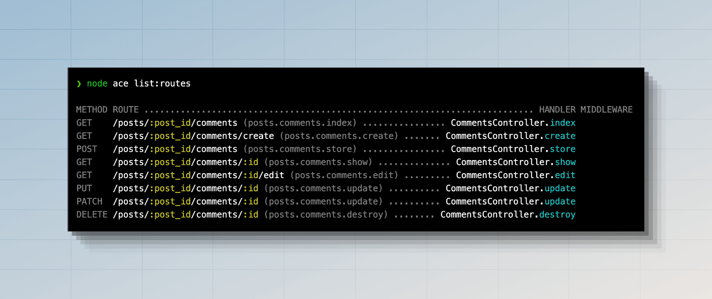

# 控制器

HTTP 控制器提供了一个抽象层，用于在专用文件中组织路由处理程序。你无需在路由文件中表达所有请求处理逻辑，而是将其移动到控制器类中。

控制器存放在 `./app/controllers` 目录中，每个控制器表示为一个普通的 JavaScript 类。你可以通过运行以下命令来创建一个新的控制器。

另请参阅：[创建控制器命令](../references/commands.md#makecontroller)

```sh
node ace make:controller users
```

新创建的控制器会包含 `class` 声明，你可以在其中手动创建方法。以本例为例，我们创建一个 `index` 方法并返回一个用户数组。

```ts
// title: app/controllers/users_controller.ts  
export default class UsersController {
  index() {
    return [
      {
        id: 1,
        username: 'virk',
      },
      {
        id: 2,
        username: 'romain',
      },
    ]
  }
}
```

最后，我们将这个控制器绑定到一个路由上。我们将使用 `#controllers` 别名导入控制器。别名是通过 [Node.js 的子路径导入功能](../getting_started/folder_structure.md#the-sub-path-imports)定义的。

```ts
// title: start/routes.ts
import router from '@adonisjs/core/services/router'
const UsersController = () => import('#controllers/users_controller')

router.get('users', [UsersController, 'index'])
```

你可能已经注意到，我们没有创建控制器类的实例，而是直接将其传递给路由。这样做允许AdonisJS：

- 为每个请求创建一个新的控制器实例。
- 使用[IoC 容器](../concepts/dependency_injection.md)构造类，从而允许你利用自动依赖注入。

你还可以注意到，我们使用函数来懒加载控制器。

:::warning

在使用[HMR（热模块替换）](../concepts/hmr.md)时，需要懒加载控制器。

:::

随着代码库的增长，你会发现它开始影响应用程序的启动时间。一个常见的原因是在路由文件中导入所有控制器。

由于控制器处理 HTTP 请求，它们经常导入其他模块，如模型、验证器或第三方包。因此，路由文件成为导入整个代码库的中心点。

懒加载非常简单，只需将导入语句放在函数后面并使用动态导入即可。

:::tip

你可以使用我们的[ESLint 插件](https://github.com/adonisjs/tooling-config/tree/main/packages/eslint-plugin)来强制和自动将标准控制器导入转换为懒加载动态导入。

:::

### 使用魔法字符串

另一种懒加载控制器的方法是将控制器及其方法作为字符串引用。我们称之为魔法字符串，因为字符串本身没有意义，它只是路由器用来查找控制器并在后台导入它的。

在以下示例中，我们在路由文件中没有任何导入语句，而是将控制器导入路径+方法作为字符串绑定到路由上。

```ts
// title: start/routes.ts
import router from '@adonisjs/core/services/router'

router.get('users', '#controllers/users_controller.index')
```

魔法字符串的唯一缺点是它们不是类型安全的。如果在导入路径中出现拼写错误，编辑器不会给你任何反馈。

从积极的一面来看，魔法字符串可以清理路由文件中由于导入语句而产生的视觉混乱。

使用魔法字符串是主观的，你可以决定是个人使用还是团队使用。

## 单操作控制器

AdonisJS 提供了一种定义单操作控制器的方法。这是一种将功能封装到命名清晰的类中的有效方式。要实现这一点，你需要在控制器中定义一个 `handle` 方法。

```ts
// title: app/controllers/register_newsletter_subscription_controller.ts
export default class RegisterNewsletterSubscriptionController {
  handle() {
    // ...
  }
}
```

然后，你可以在路由上引用该控制器，如下所示。

```ts
// title: start/routes.ts
router.post('newsletter/subscriptions', [RegisterNewsletterSubscriptionController])
```

## HTTP 上下文

控制器方法接收一个 [HttpContext](../concepts/http_context.md) 类的实例作为第一个参数。

```ts
// title: app/controllers/users_controller.ts
import type { HttpContext } from '@adonisjs/core/http'

export default class UsersController {
  index(context: HttpContext) {
    // ...
  }
}
```

## 依赖注入

控制器类是使用 [IoC 容器](../concepts/dependency_injection.md)实例化的；因此，你可以在控制器构造函数或控制器方法中类型提示依赖项。

假设你有一个`UserService`类，你可以在控制器中注入其实例，如下所示。

```ts
// title: app/services/user_service.ts
export class UserService {
  all() {
    // 从数据库中返回用户
  }
}
```

```ts
// title: app/controllers/users_controller.ts
import { inject } from '@adonisjs/core'
import UserService from '#services/user_service'

@inject()
export default class UsersController {
  constructor(
    private userService: UserService
  ) {}

  index() {
    return this.userService.all()
  }
}
```

### 方法注入

你可以使用[方法注入](../concepts/dependency_injection.md#using-method-injection)直接在控制器方法中注入 `UserService` 的实例。在这种情况下，你必须在方法名称上应用 `@inject` 装饰器。

传递给控制器方法的第一个参数始终是 [`HttpContext`](../concepts/http_context.md) 。因此，你必须将`UserService`类型提示为第二个参数。

```ts
// title: app/controllers/users_controller.ts
import { inject } from '@adonisjs/core'
import { HttpContext } from '@adonisjs/core/http'
import UserService from '#services/user_service'

export default class UsersController {
  @inject()
  index(ctx: HttpContext, userService: UserService) {
    return userService.all()
  }
}
```

### 依赖树

依赖项的自动解析不仅限于控制器。注入到控制器中的任何类也可以类型提示依赖项，IoC 容器将为你构建依赖树。

例如，让我们修改 `UserService` 类以接受一个 [HttpContext](../concepts/http_context.md) 实例作为构造函数依赖项。

```ts
// title: app/services/user_service.ts
import { inject } from '@adonisjs/core'
import { HttpContext } from '@adonisjs/core/http'

@inject()
export class UserService {
  constructor(
    private ctx: HttpContext
  ) {}

  all() {
    console.log(this.ctx.auth.user)
    // 从数据库中返回用户
  }
}
```

进行此更改后，`UserService` 将自动接收一个 `HttpContext` 类的实例。此外，控制器中无需进行任何更改。

## 资源驱动型控制器

对于传统的 [RESTful](https://en.wikipedia.org/wiki/Representational_state_transfer) 应用程序，控制器应仅设计为管理单个资源。资源通常是应用程序中的一个实体，如 **User 资源** 或 **Post 资源**。

让我们以 Post 资源为例，并定义处理其 CRUD 操作的端点。我们将首先创建一个控制器。

你可以使用 `make:controller` ace 命令为资源创建一个控制器。`--resource` 标志会为控制器搭建以下方法。

```sh
node ace make:controller posts --resource
```

```ts
// title: app/controllers/posts_controller.ts
import type { HttpContext } from '@adonisjs/core/http'

export default class PostsController {
  /**
   * 返回所有帖子列表或分页浏览
   */
  async index({}: HttpContext) {}

  /**
   * 渲染创建新帖子的表单。
   *
   * 如果创建的是API服务器，则不需要。
   */
  async create({}: HttpContext) {}

  /**
   * 处理表单提交以创建新帖子
   */
  async store({ request }: HttpContext) {}

  /**
   * 通过ID显示单个帖子。
   */
  async show({ params }: HttpContext) {}

  /**
   * 渲染编辑现有帖子的表单，通过其ID。
   *
   * 如果创建的是API服务器，则不需要。
   */
  async edit({ params }: HttpContext) {}

  /**
   * 处理表单提交以更新特定帖子，通过其ID
   */
  async update({ params, request }: HttpContext) {}

  /**
   * 处理表单提交以删除特定帖子，通过其ID。
   */
  async destroy({ params }: HttpContext) {}
}
```

接下来，我们使用 `router.resource` 方法将 `PostsController` 绑定到一个资源路由上。该方法接受资源名称作为第一个参数，控制器引用作为第二个参数。

```ts
// title: start/routes.ts
import router from '@adonisjs/core/services/router'
const PostsController = () => import('#controllers/posts_controller')

router.resource('posts', PostsController)
```

以下是`resource`方法注册的路由列表。你可以通过运行`node ace list:routes`命令查看此列表。


### 嵌套资源

可以通过指定父资源和子资源名称（使用点`.`表示法分隔）来创建嵌套资源。

在以下示例中，我们为`posts`资源下的`comments`资源创建路由。

```ts
router.resource('posts.comments', CommentsController)
```



### 浅资源

使用嵌套资源时，子资源的路由始终以父资源名称及其ID为前缀。例如：

- `/posts/:post_id/comments` 路由显示给定帖子的所有评论列表。
- `/posts/:post_id/comments/:id` 路由通过ID显示单个评论。

第二个路由中的 `/posts/:post_id` 是无关紧要的，因为你可以通过ID查找评论。

浅资源通过保持URL结构扁平（在可能的情况下）来注册其路由。这次，我们将 `posts.comments` 注册为浅资源。

```ts
router.shallowResource('posts.comments', CommentsController)
```


### 命名资源路由

使用 `router.resource` 方法创建的路由以其资源名称和控制器操作为命名依据。首先，我们将资源名称转换为蛇形命名法，并使用点`.`分隔符连接操作名称。

| 资源         | 操作名称 | 路由名称               |
|--------------|----------|------------------------|
| posts        | index    | `posts.index`          |
| userPhotos   | index    | `user_photos.index`    |
| group-attributes | show   | `group_attributes.index` |

你可以使用 `resource.as` 方法为所有路由重命名前缀。在以下示例中，我们将 `group_attributes.index` 路由名称重命名为 `attributes.index` 。

```ts
// title: start/routes.ts
router.resource('group-attributes', GroupAttributesController).as('attributes')
```

传递给 `resource.as` 方法的前缀将转换为蛇形命名法。如果你想关闭转换，可以如下所示。

```ts
// title: start/routes.ts
router.resource('group-attributes', GroupAttributesController).as('groupAttributes', false)
```

### 注册仅 API 路由

在创建API服务器时，创建和更新资源的表单由前端客户端或移动应用程序渲染。因此，为这些端点创建路由是多余的。

你可以使用 `resource.apiOnly` 方法删除 `create` 和 `edit` 路由。结果，将仅创建五个路由。

```ts
// title: start/routes.ts
router.resource('posts', PostsController).apiOnly()
```

### 注册仅特定路由

要仅注册特定路由，你可以使用 `resource.only` 或 `resource.except` 方法。

`resource.only` 方法接受一个操作名称数组，并删除除指定路由外的所有其他路由。在以下示例中，仅注册 `index` 、 `store` 和 `destroy` 操作的路由。

```ts
// title: start/routes.ts
router
  .resource('posts', PostsController)
  .only(['index', 'store', 'destroy'])
```

`resource.except` 方法是 `only` 方法的对立面，注册所有路由，但排除指定的路由。

```ts
// title: start/routes.ts
router
  .resource('posts', PostsController)
  .except(['destroy'])
```

### 重命名资源参数

`router.resource` 方法生成的路由使用 `id` 作为参数名称。例如，`GET /posts/:id` 用于查看单个帖子，`DELETE /post/:id` 用于删除帖子。

你可以使用 `resource.params` 方法将参数从 `id` 重命名为其他名称。

```ts
// title: start/routes.ts
router
  .resource('posts', PostsController)
  .params({ posts: 'post' })
```

上述更改将生成以下路由（显示部分列表）。

| HTTP 方法 | 路由               | 控制器方法 |
|-----------|--------------------|------------|
| GET       | `/posts/:post`     | show       |
| GET       | `/posts/:post/edit` | edit       |
| PUT       | `/posts/:post`     | update     |
| DELETE    | `/posts/:post`     | destroy    |

你还可以在使用嵌套资源时重命名参数。

```ts
// title: start/routes.ts
router
  .resource('posts.comments', PostsController)
  .params({
    posts: 'post',
    comments: 'comment',
  })
```

### 为资源路由分配中间件

你可以使用 `resource.use` 方法为资源注册的路由分配中间件。该方法接受一个操作名称数组和要分配给它们的中间件。例如：

```ts
// title: start/routes.ts
import router from '@adonisjs/core/services/router'
import { middleware } from '#start/kernel'

router
  .resource('posts')
  .use(
    ['create', 'store', 'update', 'destroy'],
    middleware.auth()
  )
```

你可以使用通配符(*)关键字将中间件分配给所有路由。

```ts
// title: start/routes.ts
router
  .resource('posts')
  .use('*', middleware.auth())
```

最后，你可以多次调用`.use`方法来分配多个中间件。例如：

```ts
// title: start/routes.ts
router
  .resource('posts')
  .use(
    ['create', 'store', 'update', 'destroy'],
    middleware.auth()
  )
  .use(
    ['update', 'destroy'],
    middleware.someMiddleware()
  )
```
