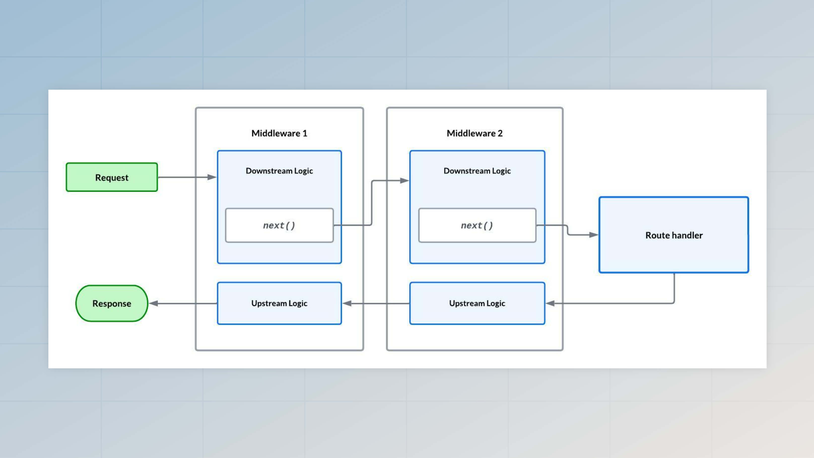

# 中间件

中间件是一系列在HTTP请求到达路由处理程序之前执行的函数。链中的每个函数都可以结束请求或将其转发到下一个中间件。

一个典型的 AdonisJS 应用程序使用中间件来进行**解析请求体**、**管理用户会话**、**认证请求**、**提供静态资源**等操作。

您还可以创建自定义中间件来在 HTTP 请求期间执行其他任务。

## 中间件栈

为了给您更好地控制中间件管道的执行，AdonisJS 将中间件栈分为以下三组。

### 服务器中间件栈

服务器中间件在每个 HTTP 请求上运行，即使您没有为当前请求的URL定义任何路由。

它们非常适合为您的应用程序添加不依赖于框架路由系统的额外功能。例如，静态资源中间件被注册为服务器中间件。

您可以在 `start/kernel.ts` 文件中使用 `server.use` 方法来注册服务器中间件。

```ts
import server from '@adonisjs/core/services/server'

server.use([
  () => import('@adonisjs/static/static_middleware')
])
```

---

### 路由中间件栈

路由中间件也称为全局中间件。它们在每个具有匹配路由的 HTTP 请求上执行。

Bodyparser 、 auth 和 session 中间件被注册在路由中间件栈下。

您可以在 `start/kernel.ts` 文件中使用 `router.use` 方法来注册路由中间件。

```ts
import router from '@adonisjs/core/services/router'

router.use([
  () => import('@adonisjs/core/bodyparser_middleware')
])
```

---

### 命名中间件集合

命名中间件是一组中间件，除非明确分配给路由或路由组，否则它们不会被执行。

我们建议您创建专用的中间件类，将它们存储在命名中间件集合中，然后将它们分配给路由，而不是在路由文件中将中间件定义为内联回调函数。

您可以在 `start/kernel.ts` 文件中使用 `router.named` 方法来定义命名中间件。确保导出命名集合以便在[路由文件中](#assigning-middleware-to-routes-and-route-groups)使用。

```ts
import router from '@adonisjs/core/services/router'

router.named({
  auth: () => import('#middleware/auth_middleware')
})
```

## 创建中间件

中间件存储在 `./app/middleware` 目录中，您可以通过运行 `make:middleware` ace 命令来创建一个新的中间件文件。

另请参阅：[创建中间件命令](../references/commands.md#makemiddleware)

```sh
node ace make:middleware user_location
```

上述命令将在中间件目录下创建 `user_location_middleware.ts` 文件。

中间件表示为一个带有 `handle` 方法的类。在执行时，AdonisJS 将自动调用此方法，并将 [HttpContext](../concepts/http_context.md) 作为第一个参数传递给它。

```ts
// title: app/middleware/user_location_middleware.ts
import { HttpContext } from '@adonisjs/core/http'
import { NextFn } from '@adonisjs/core/types/http'

export default class UserLocationMiddleware {
  async handle(ctx: HttpContext, next: NextFn) {
  }
}
```

在 `handle` 方法中，中间件必须决定是否继续请求、通过发送响应来结束请求或引发异常以中止请求。

### 中止请求

如果中间件引发异常，所有即将执行的中间件和路由处理程序将不会被执行，异常将被传递给全局异常处理程序。

```ts
import { Exception } from '@adonisjs/core/exceptions'
import { NextFn } from '@adonisjs/core/types/http'

export default class UserLocationMiddleware {
  async handle(ctx: HttpContext, next: NextFn) {
    throw new Exception('Aborting request')
  }
}
```

### 继续请求

您必须调用 `next` 方法来继续请求。否则，中间件栈中的其余操作将不会被执行。

```ts
export default class UserLocationMiddleware {
  async handle(ctx: HttpContext, next: NextFn) {
    // 调用 `next` 函数以继续
    await next()      
  }
}
```

### 发送响应，并且不调用`next`方法

最后，您可以通过发送响应来结束请求。在这种情况下，不要调用 `next` 方法。

```ts
export default class UserLocationMiddleware {
  async handle(ctx: HttpContext, next: NextFn) {
    // 发送响应 + 不调用 next
    ctx.response.send('Ending request')
  }
}
```

## 将中间件分配给路由和路由组

默认情况下，命名中间件集合不会被使用，您必须明确将它们分配给路由或路由组。

在以下示例中，我们首先导入 `middleware` 集合，并将 `userLocation` 中间件分配给一个路由。

```ts
import router from '@adonisjs/core/services/router'
import { middleware } from '#start/kernel'

router
  .get('posts', () => {})
  .use(middleware.userLocation())
```

可以将多个中间件作为数组应用，或者多次调用 `use` 方法。

```ts
router
  .get('posts', () => {})
  .use([
    middleware.userLocation(),
    middleware.auth()
  ])
```

类似地，您还可以将中间件分配给路由组。组中间件将自动应用于所有组路由。

```ts
import router from '@adonisjs/core/services/router'
import { middleware } from '#start/kernel'

router.group(() => {

  router.get('posts', () => {})
  router.get('users', () => {})
  router.get('payments', () => {})

}).use(middleware.userLocation())
```

## 中间件参数

注册在命名中间件集合下的中间件可以接受一个额外的参数作为 `handle` 方法参数的一部分。例如，`auth` 中间件接受认证防护作为配置选项。

```ts
type AuthGuards = 'web' | 'api'

export default class AuthMiddleware {
  async handle(ctx, next, options: { guard: AuthGuards }) {
  }
}
```

在将中间件分配给路由时，您可以指定要使用的防护。

```ts
import router from '@adonisjs/core/services/router'
import { middleware } from '#start/kernel'

router.get('payments', () => {}).use(
  middleware.auth({ guard: 'web' })
)
```

## 依赖注入

中间件类是使用 [IoC容 器](../concepts/dependency_injection.md)实例化的；因此，您可以在中间件构造函数中类型提示依赖项，容器将为您注入它们。

假设您有一个 `GeoIpService` 类来根据请求IP查找用户位置，您可以使用 `@inject` 装饰器将其注入到中间件中。

```ts
// title: app/services/geoip_service.ts
export class GeoIpService {
  async lookup(ipAddress: string) {
    // 查找位置并返回
  }
}
```

```ts
import { inject } from '@adonisjs/core'
import { GeoIpService } from '#services/geoip_service'
import type { HttpContext } from '@adonisjs/core/http'
import type { NextFn } from '@adonisjs/core/types/http'

@inject()
export default class UserLocationMiddleware {
  constructor(protected geoIpService: GeoIpService) {
  }

  async handle(ctx: HttpContext, next: NextFn) {
    const ip = ctx.request.ip()
    ctx.location = await this.geoIpService.lookup(ip)
  }
}
```

## 中间件执行流程

AdonisJS 的中间件层建立在[责任链](https://refactoring.guru/design-patterns/chain-of-responsibility)设计模式之上。中间件有两个执行阶段：**下游阶段**和**上游阶段**。

- 下游阶段是您在调用 `next` 方法之前编写的代码块。在此阶段，您处理请求。
- 上游阶段是您在调用 `next` 方法之后可能编写的代码块。在此阶段，您可以检查响应或完全更改它。

:::note

译者注：用传递水桶的方式来模拟责任链的执行，水桶从上游往下游传递，在调用 `next` 方法之前，水桶还没传到你，你是在水桶的下游（处理请求），调用 `next` 方法之后，水桶已经被传到下游，你就是在上游（处理响应）。

本人觉得用洋葱模型来描述中间件的责任链更形象，也更容易理解。

:::



## 中间件和异常处理

AdonisJS 自动捕获中间件管道或路由处理程序引发的异常，并使用[全局异常处理程序](./exception_handling.md)将其转换为 HTTP 响应。

因此，您无需将 `next` 函数调用包装在 `try/catch` 语句中。此外，自动异常处理确保中间件的上游逻辑总是在 `next` 函数调用之后执行。

## 从中间件修改响应

中间件的上游阶段可以修改响应体、标头和状态码。这样做将丢弃路由处理程序或任何其他中间件设置的旧响应。

在修改响应之前，您必须确保处理的是正确的响应类型。以下是 `Response` 类中的响应类型列表。

- **标准响应**指的是使用 `response.send` 方法发送数据值。其值可能是 `Array` 、 `Object` 、`String` 、 `Boolean` 或 `Buffer`。
- **流式响应**指的是使用 `response.stream` 方法将流管道传输到响应套接字。
- **文件下载响应**指的是使用 `response.download` 方法下载文件。

根据响应类型，您将有/没有权限访问特定的响应属性。

### 处理标准响应

在修改标准响应时，您可以使用 `response.content` 属性访问它。确保首先检查 `content` 是否存在。

```ts
import { HttpContext } from '@adonisjs/core/http'
import { NextFn } from '@adonisjs/core/types/http'

export default class {
  async handle({ response }: HttpContext, next: NextFn) {
    await next()
    
    if (response.hasContent) {
      console.log(response.content)
      console.log(typeof response.content)
      
      response.send(newResponse)
    }
  }
}
```

### 处理流式响应

使用 `response.stream` 方法设置的响应流不会立即管道传输到传出的 [HTTP 响应](https://nodejs.org/api/http.html#class-httpserverresponse)。相反，AdonisJS 等待路由处理程序和中间件管道完成。

因此，在中间件中，您可以替换现有的流以使用新的流，或者定义事件处理程序来监视流。

```ts
import { HttpContext } from '@adonisjs/core/http'
import { NextFn } from '@adonisjs/core/types/http'

export default class {
  async handle({ response }: HttpContext, next: NextFn) {
    await next()
    
    if (response.hasStream) {
      response.outgoingStream.on('data', (chunk) => {
        console.log(chunk)
      })
    }
  }
}
```

### 处理文件下载

使用 `response.download` 和 `response.attachment` 方法执行的文件下载会延迟下载过程，直到路由处理程序和中间件管道完成。

因此，在中间件中，您可以替换要下载的文件路径。

```ts
import { HttpContext } from '@adonisjs/core/http'
import { NextFn } from '@adonisjs/core/types/http'

export default class {
  async handle({ response }: HttpContext, next: NextFn) {
    await next()
    
    if (response.hasFileToStream) {
      console.log(response.fileToStream.generateEtag)
      console.log(response.fileToStream.path)
    }
  }
}
```

## 测试中间件类

将中间件创建为类允许您轻松地对中间件进行隔离测试（即单元测试中间件）。测试中间件有几种不同的方法。让我们探索所有可用的选项。

最简单的方法是创建中间件类的一个新实例，并使用 HTTP 上下文和 `next` 回调函数调用 `handle` 方法。

```ts
import testUtils from '@adonisjs/core/services/test_utils'
import GeoIpService from '#services/geoip_service'
import UserLocationMiddleware from '#middleware/user_location_middleware'

const middleware = new UserLocationMiddleware(
  new GeoIpService()
)

const ctx = testUtils.createHttpContext()
await middleware.handle(ctx, () => {
  console.log('Next function invoked')
})
```

`testUtils` 服务仅在 AdonisJS 应用程序启动后才可用。但是，如果您正在包中测试中间件，可以使用`HttpContextFactory` 类创建一个虚拟 HTTP 上下文实例，而无需启动应用程序。

另请参阅：[CORS 中间件测试](https://github.com/adonisjs/cors/blob/main/tests/cors_middleware.spec.ts#L24-L41)以获得实际示例。

```ts
import {
  RequestFactory,
  ResponseFactory,
  HttpContextFactory
} from '@adonisjs/core/factories/http'

const request = new RequestFactory().create()
const response = new ResponseFactory().create()
const ctx = new HttpContextFactory()
  .merge({ request, response })
  .create()

await middleware.handle(ctx, () => {
  console.log('Next function invoked')
})
```

我们的中间件依赖于其他中间件先执行，您可以使用 `server.pipeline` 方法来构建一个中间件管道。

- `server.pipeline` 方法接受一个中间件类数组。
- 类实例是使用 IoC 容器创建的。
- 执行流程与 HTTP 请求期间中间件的原始执行流程相同。

```ts
import testUtils from '@adonisjs/core/services/test_utils'
import server from '@adonisjs/core/services/server'
import UserLocationMiddleware from '#middleware/user_location_middleware'

const pipeline = server.pipeline([
  UserLocationMiddleware
])

const ctx = testUtils.createHttpContext()
await pipeline.run(ctx)
```

在调用 `pipeline.run` 方法之前，您可以定义 `finalHandler` 和 `errorHandler` 函数。

- 最终处理器在所有中间件执行完毕后执行。如果任何中间件在不调用 `next` 方法的情况下结束链，则最终处理器不会被执行。
- 如果中间件引发异常，则错误处理器会被执行。错误处理器被调用后，上游流程将开始。

```ts
const ctx = testUtils.createHttpContext()

await pipeline
 .finalHandler(() => {
   console.log('所有中间件调用了 next')
   console.log('上游逻辑从这里开始')
 })
 .errorHandler((error) => {
   console.log('引发了异常')
   console.log('上游逻辑从这里开始')
 })
 .run(ctx)
 
console.log('管道已执行')
```

`server` 服务在应用程序启动后才可用。但是，如果您正在创建一个包，可以使用 `ServerFactory` 来创建 Server 类的实例，而无需启动应用程序。

```ts
import { ServerFactory } from '@adonisjs/core/factories/http'

const server = new ServerFactory().create()
const pipeline = server.pipeline([
  UserLocationMiddleware
])
```
