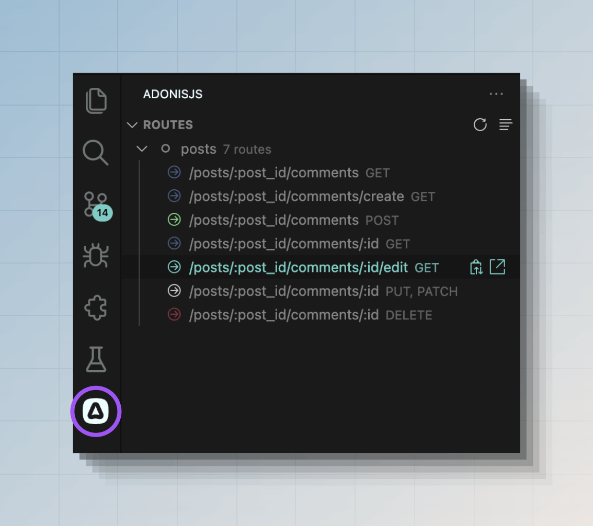

# 路由

你的网站或 Web 应用程序的用户可以访问不同的 URL，如 `/` 、 `/about` 或 `/posts/1` 。为了使这些 URL 正常工作，你需要定义路由。

在 AdonisJS 中，路由在 `start/routes.ts`文 件中定义。路由是一个**URI 模式**和**处理程序**的组合，用于处理特定路由的请求。例如：

```ts
// title: start/routes.ts
import router from '@adonisjs/core/services/router'

router.get('/', () => {
  return 'Hello world from the home page.'
})

router.get('/about', () => {
  return 'This is the about page.'
})

router.get('/posts/:id', ({ params }) => {
  return `This is post with id ${params.id}`
})
```

上述示例中的最后一个路由使用了动态URI模式。`:id` 是一种告诉路由器接受任何 `id` 值的方式。我们称它们为**路由参数**。

## 查看已注册路由列表

你可以运行`list:routes`命令来查看应用程序注册的路由列表。

```sh
node ace list:routes
```

此外，如果你正在使用我们的[官方 VSCode 扩展](https://marketplace.visualstudio.com/items?itemName=jripouteau.adonis-vscode-extension)，你还可以在 VSCode 活动栏中查看路由列表。



## 路由参数

路由参数允许你定义可以接受动态值的 URI。每个参数捕获 URI 段的值，你可以在路由处理程序中访问该值。

路由参数始终以冒号 `:` 开头，后跟参数名称。

```ts
// title: start/routes.ts
import router from '@adonisjs/core/services/router'

router.get('/posts/:id', ({ params }) => {
  return params.id
})
```

| URL              | Id        |
|------------------|-----------|
| `/posts/1`       | `1`       |
| `/posts/100`     | `100`     |
| `/posts/foo-bar` | `foo-bar` |

一个 URI 也可以接受多个参数。每个参数应具有唯一的名称。

```ts
// title: start/routes.ts
import router from '@adonisjs/core/services/router'

router.get('/posts/:id/comments/:commentId', ({ params }) => {
  console.log(params.id)
  console.log(params.commentId)
})
```

| URL                          | Id        | Comment Id |
|------------------------------|-----------|------------|
| `/posts/1/comments/4`        | `1`       | `4`        |
| `/posts/foo-bar/comments/22` | `foo-bar` | `22`       |

### 可选参数

通过在参数名称末尾附加问号 `?`，路由参数也可以成为可选的。可选参数应在必需参数之后。

```ts
// title: start/routes.ts
import router from '@adonisjs/core/services/router'

router.get('/posts/:id?', ({ params }) => {
  if (!params.id) {
    return 'Showing all posts'
  }

  return `Showing post with id ${params.id}`
})
```

### 通配符参数

要捕获URI的所有段，你可以定义一个通配符参数。通配符参数使用特殊 `*` 关键字指定，并且必须定义在最后一个位置。

```ts
// title: start/routes.ts
import router from '@adonisjs/core/services/router'

router.get('/docs/:category/*', ({ params }) => {
  console.log(params.category)
  console.log(params['*'])
})
```

| URL                  | Category | Wildcard param   |
|----------------------|----------|------------------|
| `/docs/http/context` | `http`   | `['context']`    |
| `/docs/api/sql/orm`  | `api`    | `['sql', 'orm']` |

### 参数匹配器

路由器不知道你要接受的参数数据的格式。例如，URI为 `/posts/foo-bar` 和 `/posts/1` 的请求将匹配相同的路由。但是，你可以使用参数匹配器显式验证参数值。

通过链接 `where()` 方法注册匹配器。第一个参数是参数名称，第二个参数是匹配器对象。

在以下示例中，我们定义一个正则表达式来验证 `id` 是否为有效数字。如果验证失败，将跳过该路由。

```ts
// title: start/routes.ts
import router from '@adonisjs/core/services/router'

router
  .get('/posts/:id', ({ params }) => {})
  .where('id', {
    match: /^[0-9]+$/,
  })
```

除了 `match` 正则表达式外，你还可以定义一个 `cast` 函数来将参数值转换为正确的数据类型。在此示例中，我们可以将 `id` 转换为数字。

```ts
// title: start/routes.ts
import router from '@adonisjs/core/services/router'

router
  .get('/posts/:id', ({ params }) => {
    console.log(typeof params.id)
  })
  .where('id', {
    match: /^[0-9]+$/,
    cast: (value) => Number(value),
  })
```

### 内置匹配器

路由器附带了一些用于常用数据类型的辅助方法。

```ts
// title: start/routes.ts
import router from '@adonisjs/core/services/router'

// 验证 id 为数字并将其转换为数字数据类型
router.where('id', router.matchers.number())

// 验证 id 为有效的 UUID
router.where('id', router.matchers.uuid())

// 验证 slug 以匹配给定的 slug 正则表达式：regexr.com/64su0
router.where('slug', router.matchers.slug())
```

### 全局匹配器

可以在路由器实例上全局定义路由匹配器。除非在路由级别明确覆盖，否则全局匹配器将应用于所有路由。

```ts
// title: start/routes.ts
import router from '@adonisjs/core/services/router'

// 全局匹配器
router.where('id', router.matchers.uuid())

router
  .get('/posts/:id', () => {})
  // 在路由级别覆盖
  .where('id', router.matchers.number())
```

## HTTP  方法

`router.get()` 方法创建一个响应 [GET HTTP 方法](https://developer.mozilla.org/en-US/docs/Web/HTTP/Methods/GET)的路由。类似地，你可以使用以下方法为不同的 HTTP 方法注册路由。

```ts
// title: start/routes.ts
import router from '@adonisjs/core/services/router'

// GET方法
router.get('users', () => {})

// POST方法
router.post('users', () => {})

// PUT方法
router.put('users/:id', () => {})

// PATCH方法
router.patch('users/:id', () => {})

// DELETE方法
router.delete('users/:id', () => {})
```

你可以使用 `router.any()` 方法创建一个响应所有标准HTTP方法的路由。

```ts
// title: start/routes.ts
router.any('reports', () => {})
```

最后，你可以使用 `router.route()` 方法为自定义 HTTP 方法创建路由。

```ts
// title: start/routes.ts
router.route('/', ['TRACE'], () => {})
```

## 路由处理程序

路由处理程序通过返回响应或引发异常来中止请求，从而处理请求。

处理程序可以是内联回调（如本指南中所示）或对控制器方法的引用。

```ts
// title: start/routes.ts
router.post('users', () => {
  // 执行一些操作
})
```

:::note

路由处理程序可以是异步函数，AdonisJS 将自动处理 Promise 解析。

:::

在以下示例中，我们导入 `UsersController` 类并将其绑定到路由。在 HTTP 请求期间，AdonisJS 将使用 IoC 容器创建控制器类的实例并执行 `store` 方法。

另请参阅：[控制器专用指南](./controllers.md)。

```ts
// title: start/routes.ts
const UsersController = () => import('#controllers/users_controller')

router.post('users', [UsersController, 'store'])
```

## 路由中间件

你可以通过链式调用 `use()` 方法在路由上定义中间件。该方法接受内联回调或对命名中间件的引用。

以下是定义路由中间件的最小示例。我们建议你阅读[中间件专用指南](./middleware.md)，以探索所有可用选项和中间件的执行流程。

```ts
// title: start/routes.ts
router
  .get('posts', () => {
    console.log('Inside route handler')

    return 'Viewing all posts'
  })
  .use((_, next) => {
    console.log('Inside middleware')
    return next()
  })
```

## 路由标识符

每个路由都有一个唯一的标识符（即名称），你可以在应用程序的其他地方引用该路由。例如，你可以使用 [URL 构建器](#url-builder) 生成到路由的 URL，或使用 [`response.redirect()`](./response.md#redirects) 方法重定向到路由。

默认情况下，路由模式是路由标识符。但是，你可以使用 `route.as` 方法为路由分配一个唯一的、易记的名称。

```ts
// title: start/routes.ts
router.get('users', () => {}).as('users.index')

router.post('users', () => {}).as('users.store')

router.delete('users/:id', () => {}).as('users.delete')
```

现在，你可以在模板中使用路由名称或使用 URL 构建器构造 URL。

```ts
const url = router.builder().make('users.delete', [user.id])
```

```edge
<form
  method='POST'
  action="{{
    route('users.delete', [user.id], { formAction: 'delete' })
  }}"
></form>
```

## 分组路由

路由组提供了一个便利层，以便在组内批量配置嵌套。你可以使用 `router.group` 方法创建一组路由。

```ts
// title: start/routes.ts
router.group(() => {
  /**
   * 在回调中注册的所有路由
   * 都是周围组的一部分
   */
  router.get('users', () => {})
  router.post('users', () => {})
})
```

路由组可以嵌套在一起，AdonisJS 将根据应用的设置合并或覆盖属性。

```ts
// title: start/routes.ts
router.group(() => {
  router.get('posts', () => {})

  router.group(() => {
    router.get('users', () => {})
  })
})
```

### 在组内为路由添加前缀

可以使用 `group.prefix` 方法为组内的路由URI模式添加前缀。以下示例将为 `/api/users` 和 `/api/payments` URI模式创建路由。

```ts
// title: start/routes.ts
router
  .group(() => {
    router.get('users', () => {})
    router.get('payments', () => {})
  })
  .prefix('/api')
```

在嵌套组的情况下，前缀将从外组应用到内组。以下示例将为 `/api/v1/users` 和 `/api/v1/payments` URI 模式创建路由。

```ts
// title: start/routes.ts
router
  .group(() => {
    router
      .group(() => {
        router.get('users', () => {})
        router.get('payments', () => {})
      })
      .prefix('v1')
  })
  .prefix('api')
```

### 在组内为路由命名

类似于为路由模式添加前缀，你还可以使用`group.as`方法为组内的路由名称添加前缀。

:::note

组内的路由必须有名称，然后才能为它们添加前缀。

:::

```ts
// title: start/routes.ts
router
  .group(() => {
    route
      .get('users', () => {})
      .as('users.index') // 最终名称 - api.users.index
  })
  .prefix('api')
  .as('api')
```

在嵌套组的情况下，名称将从外组应用到内组。

```ts
// title: start/routes.ts
router
  .group(() => {
    route
      .get('users', () => {})
      .as('users.index') // api.users.index

    router
      .group(() => {
        route
          .get('payments', () => {})
          .as('payments.index') // api.commerce.payments.index
      })
      .as('commerce')
  })
  .prefix('api')
  .as('api')
```

### 向组内的路由应用中间件

你可以使用 `group.use` 方法为组内的路由分配中间件。组中间件在组内单个路由应用的中间件之前执行。

在嵌套组的情况下，最外层组的中间件将首先运行。换句话说，一个组会在路由中间件栈之前添加中间件。

另请参阅：[中间件指南](./middleware.md)

```ts
// title: start/routes.ts
router
  .group(() => {
    router
      .get('posts', () => {})
      .use((_, next) => {
        console.log('来自路由中间件的日志')
        return next()
      })
  })
  .use((_, next) => {
    console.log('来自组中间件的日志')
    return next()
  })
```

## 为特定域名注册路由

AdonisJS 允许你为特定域名注册路由。这对于将应用程序映射到多个域名并希望每个域名有不同路由的情况非常有用。

在以下示例中，我们定义了两组路由。

- 适用于任何域名/主机名的路由。
- 当域名/主机名与预定义的域名值匹配时匹配的路由。

```ts
// title: start/routes.ts
router.group(() => {
  router.get('/users', () => {})
  router.get('/payments', () => {})
})

router.group(() => {
  router.get('/articles', () => {})
  router.get('/articles/:id', () => {})
}).domain('blog.adonisjs.com')
```

部署应用程序后，只有在请求的主机名为`blog.adonisjs.com`时，才会匹配带有明确域名的组中的路由。

### 动态子域名

你可以使用`group.domain`方法指定动态子域名。与路由参数类似，域名的动态段以冒号`:`开头。

在以下示例中，`tenant`段接受任何子域名，你可以使用`HttpContext.subdomains`对象访问其值。

```ts
// title: start/routes.ts
router
 .group(() => {
   router.get('users', ({ subdomains }) => {
     return `Listing users for ${subdomains.tenant}`
   })
 })
 .domain(':tenant.adonisjs.com')
```

## 从路由渲染Edge视图

如果你有一个只渲染视图的路由处理程序，可以使用 `router.on().render()` 方法。这是一种方便的快捷方式，无需定义显式处理程序即可渲染视图。

渲染方法接受要渲染的Edge模板的名称。可选地，你可以将模板数据作为第二个参数传递。

:::warning

`route.on().render()` 方法仅在配置了 [Edge 服务提供程序](../views-and-templates/edgejs.md)时才存在。

:::

```ts
// title: start/routes.ts
import router from '@adonisjs/core/services/router'

router.on('/').render('home')
router.on('about').render('about', { title: 'About us' })
router.on('contact').render('contact', { title: 'Contact us' })
```

## 从路由渲染 Inertia 视图

如果你正在使用 Inertia.js 适配器，可以使用 `router.on().renderInertia()` 方法渲染 Inertia 视图。这是一种方便的快捷方式，无需定义显式处理程序即可渲染视图。

renderInertia 方法接受要渲染的 Inertia 组件的名称。可选地，你可以将组件数据作为第二个参数传递。

:::warning

`route.on().renderInertia()` 方法仅在配置了 [Inertia 服务提供程序](../views-and-templates/inertia.md)时才存在。

:::

```ts
// title: start/routes.ts
import router from '@adonisjs/core/services/router'

router.on('/').renderInertia('home')
router.on('about').renderInertia('about', { title: 'About us' })
router.on('contact').renderInertia('contact', { title: 'Contact us' })
```

## 从路由重定向

如果你正在定义一个路由处理程序以将请求重定向到另一个路径或路由，可以使用 `router.on().redirect()` 或 `router.on().redirectToPath()` 方法。

`redirect` 方法接受路由标识符。而 `redirectToPath` 方法接受静态路径 /URL。

```ts
// title: start/routes.ts
import router from '@adonisjs/core/services/router'

// 重定向到路由
router.on('/posts').redirect('/articles')

// 重定向到URL
router.on('/posts').redirectToPath('https://medium.com/my-blog')
```

### 转发参数

在以下示例中，原始请求中的`id`值将用于构造`/articles/:id`路由。因此，如果请求为`/posts/20`，则将被重定向到`/articles/20`。

```ts
// title: start/routes.ts
import router from '@adonisjs/core/services/router'

router.on('/posts/:id').redirect('/articles/:id')
```

### 明确指定参数

你还可以将路由参数明确指定为第二个参数。在这种情况下，将忽略当前请求中的参数。

```ts
// title: start/routes.ts
import router from '@adonisjs/core/services/router'

// 始终重定向到/articles/1
router.on('/posts/:id').redirect('/articles/:id', {
  id: 1
})
```

### 带查询字符串

可以在选项对象中定义重定向URL的查询字符串。

```ts
// title: start/routes.ts
import router from '@adonisjs/core/services/router'

router.on('/posts').redirect('/articles', {
  qs: {
    limit: 20,
    page: 1,
  }  
})
```

## 当前请求路由

可以使用 [`HttpContext.route`](../concepts/http_context.md#http-context-properties) 属性访问当前请求的路由。它包括**路由模式**、**名称**、**对其中间件存储的引用**和**对路由处理程序的引用**。

```ts
// title: start/routes.ts
router.get('payments', ({ route }) => {
  console.log(route)
})
```
### 检查当前请求是否为特定路由

你还可以使用 `request.matchesRoute` 方法检查当前请求是否为特定路由。该方法接受路由 URI 模式或路由名称。

```ts
// title: start/routes.ts
router.get('/posts/:id', ({ request }) => {
  if (request.matchesRoute('/posts/:id')) {
  }
})
```

```ts
// title: start/routes.ts
router
  .get('/posts/:id', ({ request }) => {
    if (request.matchesRoute('posts.show')) {
    }
  })
  .as('posts.show')
```

你还可以匹配多个路由。该方法在找到第一个匹配项时返回 true。

```ts
if (request.matchesRoute(['/posts/:id', '/posts/:id/comments'])) {
  // 执行操作
}
```

## AdonisJS 如何匹配路由

路由按它们在路由文件中注册的顺序进行匹配。我们从最顶层的路由开始匹配，并在找到第一个匹配的路由时停止。

如果你有两个相似的路由，必须先注册最具体的路由。

在以下示例中，对 URL `/posts/archived` 的请求将由第一个路由（即 `/posts/:id` ）处理，因为动态参数 `id` 将捕获 `archived` 值。

```ts
// title: start/routes.ts
import router from '@adonisjs/core/services/router'

router.get('posts/:id', () => {})
router.get('posts/archived', () => {})
```

可以通过重新排序路由来解决此问题，将最具体的路由放在具有动态参数的路由之前。

```ts
// title: start/routes.ts
router.get('posts/archived', () => {})
router.get('posts/:id', () => {})
```

### 处理404请求

如果当前请求的 URL 没有匹配的路由，AdonisJS 将引发 404 异常。

要向用户显示 404 页面，可以在[全局异常处理程序](./exception_handling.md)中捕获 `E_ROUTE_NOT_FOUND` 异常并渲染模板。

```ts
// app/exceptions/handler.ts
import { errors } from '@adonisjs/core'
import { HttpContext, ExceptionHandler } from '@adonisjs/core/http'

export default class HttpExceptionHandler extends ExceptionHandler {
  async handle(error: unknown, ctx: HttpContext) {
    if (error instanceof errors.E_ROUTE_NOT_FOUND) {
      return ctx.view.render('errors/404')
    }
    
    return super.handle(error, ctx)
  }
}
```

## URL构建器

你可以使用 URL 构建器为应用程序中预定义的路由创建 URL。例如，在 Edge 模板中创建表单操作 URL，或将请求重定向到另一个路由的 URL。

`router.builder` 方法创建 [URL 构建器](https://github.com/adonisjs/http-server/blob/main/src/router/lookup_store/url_builder.ts)类的实例，你可以使用构建器的流畅 API 查找路由并为其创建 URL。

```ts
// title: start/routes.ts
import router from '@adonisjs/core/services/router'
const PostsController = () => import('#controllers/posts_controller')

router
  .get('posts/:id', [PostsController, 'show'])
  .as('posts.show')
```

你可以按如下方式生成`posts.show`路由的URL。

```ts
// title: start/routes.ts
import router from '@adonisjs/core/services/router'

router
  .builder()
  .params([1])
  .make('posts.show') // /posts/1

router
 .builder()
 .params([20])
 .make('posts.show') // /posts/20
```

参数可以作为位置参数的数组指定。或者，你可以将它们定义为键值对。

```ts
// title: start/routes.ts
router
 .builder()
 .params({ id: 1 })
 .make('posts.show') // /posts/1
```

### 定义查询参数

可以使用 `builder.qs` 方法定义查询参数。该方法接受一个键值对对象，并将其序列化为查询字符串。

```ts
// title: start/routes.ts
router
  .builder()
  .qs({ page: 1, sort: 'asc' })
  .make('posts.index') // /posts?page=1&sort=asc
```

查询字符串使用 [qs](https://www.npmjs.com/package/qs) npm 包进行序列化。你可以在 `config/app.ts` 文件的 `http` 对象下[配置其设置](https://github.com/adonisjs/http-server/blob/main/src/define_config.ts#L49-L54)。

```ts
// title: config/app.js
http: defineConfig({
  qs: {
    stringify: {
      // 
    }
  }
})
```

### 为 URL 添加前缀

可以使用`builder.prefixUrl`方法为输出添加基础URL前缀。

```ts
// title: start/routes.ts
router
  .builder()
  .prefixUrl('https://blog.adonisjs.com')
  .params({ id: 1 })
  .make('posts.show')
```

### 生成签名 URL

签名 URL 是附加了签名查询字符串的 URL。签名用于验证 URL 在生成后是否被篡改。

例如，你有一个用于取消订阅用户新闻订阅的URL。该URL包含`userId`，可能如下所示。

```
/unsubscribe/231
```

为了防止有人将用户 ID 从 `231` 更改为其他值，你可以对 URL 进行签名，并在处理该路由的请求时验证签名。

```ts
// title: start/routes.ts
router.get('unsubscribe/:id', ({ request, response }) => {
  if (!request.hasValidSignature()) {
    return response.badRequest('Invalid or expired URL')
  }
  
  // 取消订阅
}).as('unsubscribe')
```

你可以使用 `makeSigned` 方法创建签名URL。

```ts
// title: start/routes.ts
router
  .builder()
  .prefixUrl('https://blog.adonisjs.com')
  .params({ id: 231 })
  // highlight-start
  .makeSigned('unsubscribe')
  // highlight-end
```

#### 签名URL过期

可以使用 `expiresIn` 选项生成在一定时间后过期的签名 URL 。该值可以是毫秒数或时间表达式字符串。

```ts
// title: start/routes.ts
router
  .builder()
  .prefixUrl('https://blog.adonisjs.com')
  .params({ id: 231 })
  // highlight-start
  .makeSigned('unsubscribe', {
    expiresIn: '3 days'
  })
  // highlight-end
```

### 禁用路由查找

URL构建器使用 `make` 和 `makeSigned` 方法提供的路由标识符执行路由查找。

如果你想为 AdonisJS 应用程序之外定义的路由创建 URL，可以禁用路由查找，并将路由模式提供给 `make` 和 `makeSigned` 方法。

```ts
// title: start/routes.ts
router
  .builder()
  .prefixUrl('https://your-app.com')
  .disableRouteLookup()
  .params({ token: 'foobar' })
  .make('/email/verify/:token') // /email/verify/foobar
```

### 为特定域名下的路由生成 URL

你可以使用 `router.builderForDomain` 方法为在特定域名下注册的路由生成 URL 。该方法接受在定义路由时使用的路由模式。

```ts
// title: start/routes.ts
import router from '@adonisjs/core/services/router'
const PostsController = () => import('#controllers/posts_controller')

router.group(() => {
  router
    .get('/posts/:id', [PostsController, 'show'])
    .as('posts.show')
}).domain('blog.adonisjs.com')
```

你可以按如下方式为 `blog.adonisjs.com` 域名下的 `posts.show` 路由创建URL。

```ts
// title: start/routes.ts
router
  .builderForDomain('blog.adonisjs.com')
  .params({ id: 1 })
  .make('posts.show')
```

### 在模板中生成 URL

你可以在模板中使用 `route` 和 `signedRoute` 方法，通过 URL 构建器生成 URL。

另请参阅： [Edge 帮助程序参考](../references/edge.md#routesignedroute)

```edge
<a href="{{ route('posts.show', [post.id]) }}">
  View post
</a>
```

```edge
<a href="{{
  signedRoute('unsubscribe', [user.id], {
    expiresIn: '3 days',
    prefixUrl: 'https://blog.adonisjs.com'    
  })
}}">
  Unsubscribe
</a>
```

## 扩展路由器

你可以使用宏和 getter 为不同的路由器类添加自定义属性。如果你是宏概念的新手，请确保先阅读[扩展 AdonisJS 指南](../concepts/extending_the_framework.md)。

以下是你可以扩展的类列表。

### Router

[Router 类](https://github.com/adonisjs/http-server/blob/main/src/router/main.ts)包含用于创建路由、路由组或路由资源的顶级方法。该类的一个实例通过路由器服务提供。

```ts
import { Router } from '@adonisjs/core/http'

Router.macro('property', function (this: Router) {
  return value
})
Router.getter('propertyName', function (this: Router) {
  return value
})
```

```ts
// title: types/http.ts
declare module '@adonisjs/core/http' {
  export interface Router {
    property: valueType
  }
}
```

### Route

[Route 类](https://github.com/adonisjs/http-server/blob/main/src/router/route.ts)表示单个路由。在调用 `router.get` 、 `router.post` 和其他类似方法时，会创建 Route 类的一个实例。

```ts
import { Route } from '@adonisjs/core/http'

Route.macro('property', function (this: Route) {
  return value
})
Router.getter('property', function (this: Route) {
  return value
})
```

```ts
// title: types/http.ts
declare module '@adonisjs/core/http' {
  export interface Route {
    property: valueType
  }
}
```

### RouteGroup

[RouteGroup 类](https://github.com/adonisjs/http-server/blob/main/src/router/group.ts)表示一组路由。在调用 `router.group` 方法时，会创建 RouteGroup 类的一个实例。

你可以在宏或 getter 实现中使用 `this.routes` 属性访问组的路由。

```ts
import { RouteGroup } from '@adonisjs/core/http'

RouteGroup.macro('property', function (this: RouteGroup) {
  return value
})
RouteGroup.getter('property', function (this: RouteGroup) {
  return value
})
```

```ts
// title: types/http.ts
declare module '@adonisjs/core/http' {
  export interface RouteGroup {
    property: valueType
  }
}
```

### RouteResource

[RouteResource 类](https://github.com/adonisjs/http-server/blob/main/src/router/resource.ts)表示一个资源的路由组。在调用 `router.resource` 方法时，会创建 RouteResource 类的一个实例。

你可以在宏或getter实现中使用 `this.routes` 属性访问资源的路由。

```ts
import { RouteResource } from '@adonisjs/core/http'

RouteResource.macro('property', function (this: RouteResource) {
  return value
})
RouteResource.getter('property', function (this: RouteResource) {
  return value
})
```

```ts
// title: types/http.ts
declare module '@adonisjs/core/http' {
  export interface RouteResource {
    property: valueType
  }
}
```

### BriskRoute

[BriskRoute 类](https://github.com/adonisjs/http-server/blob/main/src/router/brisk.ts)表示没有显式处理程序的路由。在调用 `router.on` 方法时，会创建 BriskRoute 类的一个实例。

你可以在宏或 getter 中调用 `this.setHandler` 方法为路由分配处理程序。

```ts
import { BriskRoute } from '@adonisjs/core/http'

BriskRoute.macro('property', function (this: BriskRoute) {
  return value
})
BriskRouter.getter('property', function (this: BriskRoute) {
  return value
})
```

```ts
// title: types/http.ts
declare module '@adonisjs/core/http' {
  export interface BriskRoute {
    property: valueType
  }