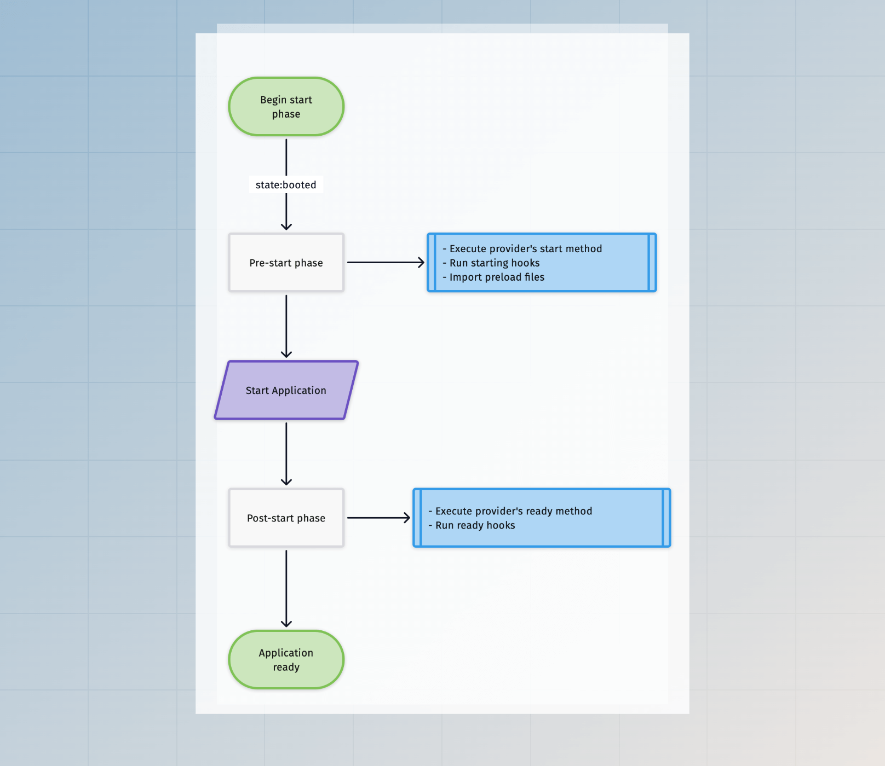
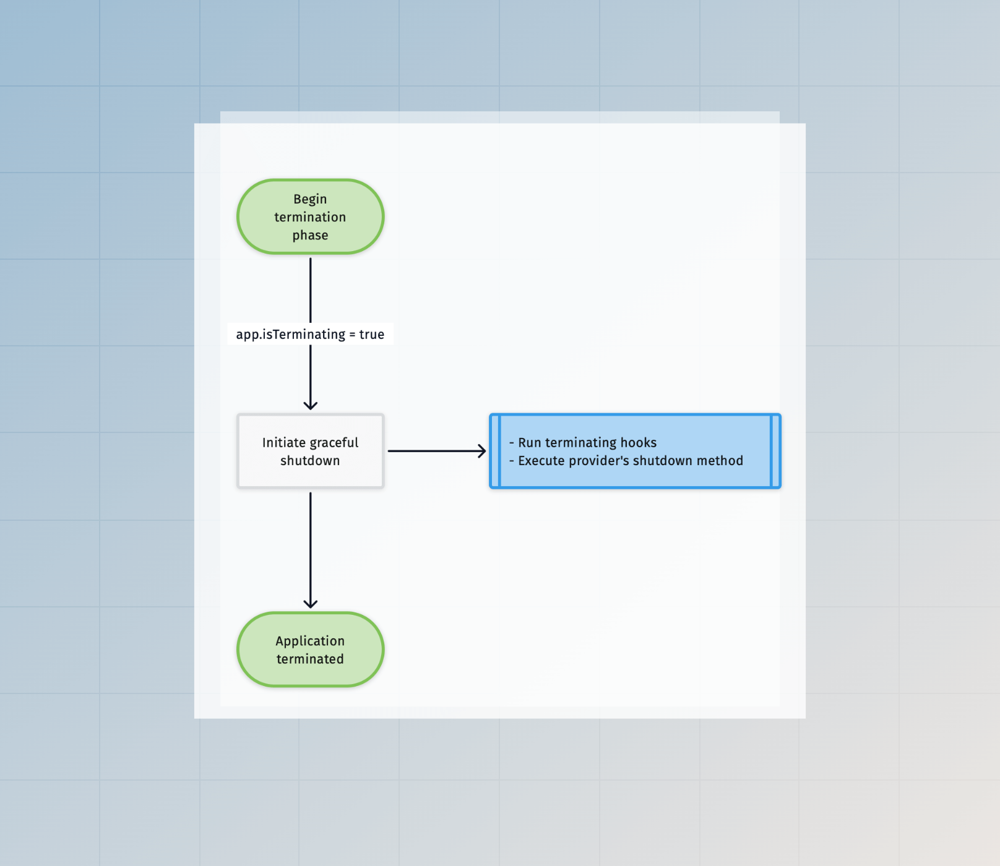

# Application 生命周期

在本指南中，我们将了解 AdonisJS 如何启动你的应用程序，以及在应用程序被认为准备就绪之前，你可以使用哪些生命周期钩子来更改应用程序状态。

应用程序的生命周期取决于其运行的环境。例如，一个用于处理 HTTP 请求的长期运行进程与一个短命的 ace 命令的管理方式是不同的。

因此，让我们来了解每个支持环境的应用程序生命周期。

## AdonisJS 应用程序如何启动
AdonisJS 应用程序有多个入口点，每个入口点都会在特定环境中启动应用程序。以下入口点文件存储在 `bin` 目录中。

- `bin/server.ts` 入口点启动 AdonisJS 应用程序以处理 HTTP 请求。当你运行 `node ace serve` 命令时，我们在后台将此文件作为子进程运行。
- `bin/console.ts` 入口点启动 AdonisJS 应用程序以处理 CLI 命令。此文件在底层使用了 [Ace](../ace/introduction.md)。
- `bin/test.ts` 入口点启动 AdonisJS 应用程序以使用 Japa 运行测试。

如果你打开这些文件中的任何一个，你会发现我们使用 [Ignitor](https://github.com/adonisjs/core/blob/main/src/ignitor/main.ts#L23) 模块来连接各个部分，然后启动应用程序。

Ignitor 模块封装了启动 AdonisJS 应用程序的逻辑。在底层，它执行以下操作：

- 创建 [Application](https://github.com/adonisjs/application/blob/main/src/application.ts) 类的实例。
- 初始化/启动应用程序。
- 执行主要操作以启动应用程序。例如，在 HTTP 服务器的情况下，`main` 操作涉及启动 HTTP 服务器。而在测试的情况下，`main` 操作涉及运行测试。

[Ignitor 代码库](https://github.com/adonisjs/core/tree/main/src/ignitor) 相对简单明了，因此请浏览源代码以更好地理解它。

## 启动阶段

除了 `console` 环境外，所有环境的启动阶段都是相同的。在 `console` 环境中，执行的命令决定是否启动应用程序。

只有在应用程序启动后，你才能使用容器绑定和服务。


## 开始阶段

开始阶段在所有环境之间有所不同。此外，执行流程进一步分为以下子阶段：

- `pre-start` 阶段指的是在启动应用程序之前执行的操作。
- `post-start` 阶段指的是在启动应用程序之后执行的操作。在 HTTP 服务器的情况下，这些操作将在 HTTP 服务器准备好接受新连接后执行。



### 在 Web 环境中

在 Web 环境中，会创建一个长期存在的 HTTP 连接来监听传入的请求，并且应用程序保持 `ready` 状态，直到服务器崩溃或进程接收到关闭信号。

### 在测试环境中

在测试环境中执行 **pre-start** 和 **post-start** 操作。之后，我们导入测试文件并执行测试。

### 在控制台环境中

在 `console` 环境中，执行的命令决定是否启动应用程序。

命令可以通过启用 `options.startApp` 标志来启动应用程序。因此，**pre-start** 和 **post-start** 操作将在命令的 `run` 方法之前运行。

```ts
import { BaseCommand } from '@adonisjs/core/ace'

export default class GreetCommand extends BaseCommand {
  static options = {
    startApp: true
  }
  
  async run() {
    console.log(this.app.isReady) // true
  }
}
```

## 终止阶段

应用程序的终止在短命进程和长命进程之间差异很大。

短命的命令或测试进程在主操作结束后开始终止。

长命的 HTTP 服务器进程等待退出信号（如 `SIGTERM`）以开始终止过程。



### 响应进程信号

在所有环境中，当应用程序接收到 `SIGTERM` 信号时，我们开始一个优雅的关闭过程。如果你使用 [pm2](https://pm2.keymetrics.io/docs/usage/signals-clean-restart/) 启动了你的应用程序，则在接收到 `SIGINT` 事件后将进行优雅的关闭。

### 在 Web 环境中

在 Web 环境中，应用程序会持续运行，直到底层的 HTTP 服务器因错误而崩溃。在这种情况下，我们开始终止应用程序。

### 在测试环境中

所有测试执行完毕后，开始优雅的终止。

### 在控制台环境中

在 `console` 环境中，应用程序的终止取决于执行的命令。

除非启用了 `options.staysAlive` 标志，否则命令执行完毕后应用程序将终止，在这种情况下，命令应显式终止应用程序。

```ts
import { BaseCommand } from '@adonisjs/core/ace'

export default class GreetCommand extends BaseCommand {
  static options = {
    startApp: true,
    staysAlive: true,
  }
  
  async run() {
    await runSomeProcess()
    
    // 终止进程
    await this.terminate()
  }
}
```

## 生命周期钩子

生命周期钩子允许你在应用程序引导过程中插入并执行操作，随着应用程序进入不同的状态。

你可以使用服务提供者类来监听钩子，或者在 Application 类上内联定义它们。

### 内联回调

你应在创建 Application 实例后立即注册生命周期钩子。

入口点文件 `bin/server.ts`、`bin/console.ts` 和 `bin/test.ts` 为不同环境创建了新的 Application 实例，你可以在这些文件中注册内联回调。

```ts
const app = new Application(new URL('../', import.meta.url))

new Ignitor(APP_ROOT, { importer: IMPORTER })
  .tap((app) => {
    // highlight-start
    app.booted(() => {
      console.log('invoked after the app is booted')
    })
    
    app.ready(() => {
      console.log('invoked after the app is ready')
    })
    
    app.terminating(() => {
      console.log('invoked before the termination starts')
    })
    // highlight-end
  })
```

- `initiating`：在应用程序进入初始化状态之前调用钩子操作。执行 `initiating` 钩子后，会解析 `adonisrc.ts` 文件。
- `booting`：在启动应用程序之前调用钩子操作。执行 `booting` 钩子后，会导入配置文件。
- `booted`：在所有服务提供者注册并启动后调用钩子操作。
- `starting`：在导入预加载文件之前调用钩子操作。
- `ready`：在应用程序准备就绪后调用钩子操作。
- `terminating`：一旦优雅的退出过程开始，就调用钩子操作。例如，此钩子可以关闭数据库连接或结束打开的流。

### 使用服务提供者

服务提供者将生命周期钩子定义为提供者类中的方法。我们建议使用服务提供者而不是内联回调，因为它们可以使一切保持井然有序。

以下是可用的生命周期方法列表。

```ts
import { ApplicationService } from '@adonisjs/core/types'

export default class AppProvider {
  constructor(protected app: ApplicationService) {}
  
  register() {
  }
  
  async boot() {
  }
  
  async start() {
  }
  
  async ready() {
  }
  
  async shutdown() {
  }
}
```

- `register`：register 方法在容器中注册绑定。此方法设计为同步的。
- `boot`：boot 方法用于启动或初始化你在容器中注册的绑定。
- `start`：start 方法在 `ready` 方法之前运行。它允许你执行 `ready` 钩子操作可能需要的操作。
- `ready`：ready 方法在应用程序被认为准备就绪后运行。
- `shutdown`：当应用程序开始优雅的关闭时，调用 shutdown 方法。你可以使用此方法关闭数据库连接或结束打开的流。