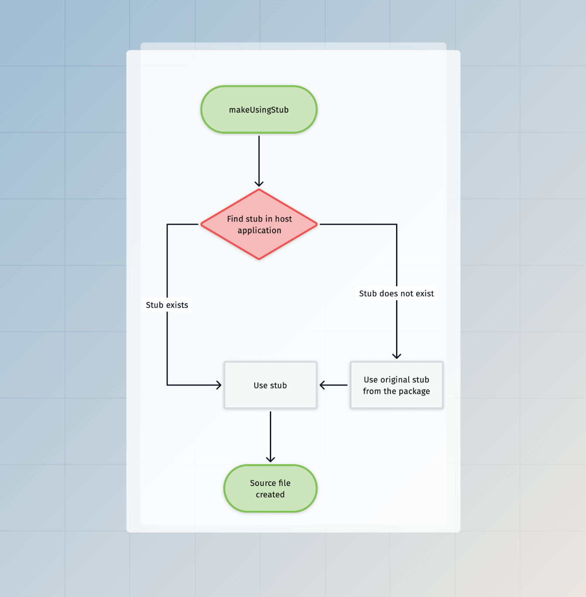

# 脚手架和 Codemods

脚手架指的是从静态模板（也称为存根）生成源文件的过程，而 codemods 指的是通过解析 AST（抽象语法树）来更新 TypeScript 源代码。

AdonisJS 使用这两者来加快创建新文件和配置包的重复性任务。在本指南中，我们将介绍脚手架的构建块，并介绍你可以在 Ace 命令中使用的 codemods API。

## 构建块

### 存根

存根是指用于在给定操作上创建源文件的模板。例如，`make:controller` 命令使用 [控制器存根](https://github.com/adonisjs/core/blob/main/stubs/make/controller/main.stub) 在宿主项目中创建一个控制器文件。

### 生成器

生成器强制执行命名约定，并根据预定义的约定生成文件、类或方法名称。

例如，控制器存根使用 [controllerName](https://github.com/adonisjs/application/blob/main/src/generators.ts#L122) 和 [controllerFileName](https://github.com/adonisjs/application/blob/main/src/generators.ts#L139) 生成器来创建控制器。

由于生成器被定义为一个对象，你可以覆盖现有方法来调整约定。稍后在本指南中我们将更详细地了解这一点。

### Codemods

Codemods API 来自 [@adonisjs/assembler](https://github.com/adonisjs/assembler/blob/main/src/code_transformer/main.ts) 包，并在底层使用 [ts-morph](https://github.com/dsherret/ts-morph)。

由于 `@adonisjs/assembler` 是一个开发依赖项，`ts-morph` 不会在生产环境中增加你的项目依赖项。此外，这意味着 codemods API 在生产环境中不可用。

AdonisJS 提供的 codemods API 非常具体，旨在完成高级任务，如 **将提供者添加到 `.adonisrc.ts` 文件**，或 **在 `start/kernel.ts` 文件中注册中间件**。此外，这些 API 依赖于默认的命名约定，因此如果你对项目进行了重大更改，将无法运行 codemods。

### 配置命令

配置命令用于配置 AdonisJS 包。在底层，该命令导入主入口点文件并执行该包导出的 `configure` 方法。

包的 `configure` 方法接收一个 [Configure 命令](https://github.com/adonisjs/core/blob/main/commands/configure.ts) 的实例，因此它可以直接从命令实例访问存根和 codemods API。

## 使用存根

大多数情况下，你会在 Ace 命令或你创建的包的 `configure` 方法中使用存根。在这两种情况下，你都可以通过 Ace 命令的 `createCodemods` 方法初始化 codemods 模块。

`codemods.makeUsingStub` 方法使用存根模板创建一个源文件。它接受以下参数：

- 存根存储目录的根 URL。
- 从 `STUBS_ROOT` 目录到存根文件的相对路径（包括扩展名）。
- 要与存根共享的数据对象。

```ts
// title: 命令内部
import { BaseCommand } from '@adonisjs/core/ace'

const STUBS_ROOT = new URL('./stubs', import.meta.url)

export default class MakeApiResource extends BaseCommand {
  async run() {
    // highlight-start
    const codemods = await this.createCodemods()
    await codemods.makeUsingStub(STUBS_ROOT, 'api_resource.stub', {})
    // highlight-end
  }
}
```

### 存根模板化

我们使用 [Tempura](https://github.com/lukeed/tempura) 模板引擎来处理带有运行时数据的存根。Tempura 是一个超级轻量级的 JavaScript handlebars 风格模板引擎。

:::tip

由于 Tempura 的语法与 handlebars 兼容，你可以将代码编辑器设置为使用 handlebar 语法高亮显示 `.stub` 文件。

:::

在以下示例中，我们创建一个输出 JavaScript 类的存根。它使用双大括号来评估运行时值。

```handlebars
export default class {{ modelName }}Resource {
  serialize({{ modelReference }}: {{ modelName }}) {
    return {{ modelReference }}.toJSON()
  }
}
```

### 使用生成器

如果你现在执行上面的存根，它会失败，因为我们没有提供 `modelName` 和 `modelReference` 数据属性。

我们建议在存根中使用内联变量来计算这些属性。这样，宿主应用程序可以 [弹出存根](#弹出存根) 并修改变量。

```js
// insert-start
{{#var entity = generators.createEntity('user')}}
{{#var modelName = generators.modelName(entity.name)}}
{{#var modelReference = string.toCamelCase(modelName)}}
// insert-end

export default class {{ modelName }}Resource {
  serialize({{ modelReference }}: {{ modelName }}) {
    return {{ modelReference }}.toJSON()
  }
}
```

### 输出目标

最后，我们需要指定使用存根创建的文件的目标路径。同样，我们在存根文件中指定目标路径，因为这允许宿主应用程序 [弹出存根](#弹出存根) 并自定义其输出目标。

目标路径是使用 `exports` 函数定义的。该函数接收一个对象并将其导出为存根的输出状态。之后，codemods API 使用此对象在指定位置创建文件。

```js
{{#var entity = generators.createEntity('user')}}
{{#var modelName = generators.modelName(entity.name)}}
{{#var modelReference = string.toCamelCase(modelName)}}
// insert-start
{{#var resourceFileName = string(modelName).snakeCase().suffix('_resource').ext('.ts').toString()}}
{{{
  exports({
    to: app.makePath('app/api_resources', entity.path, resourceFileName)
  })
}}}
// insert-end
export default class {{ modelName }}Resource {
  serialize({{ modelReference }}: {{ modelName }}) {
    return {{ modelReference }}.toJSON()
  }
}
```

### 通过命令接受实体名称

目前，我们在存根中将实体名称硬编码为 `user`。但是，你应该将其作为命令参数接受，并将其作为模板状态与存根共享。

```ts
import { BaseCommand, args } from '@adonisjs/core/ace'

export default class MakeApiResource extends BaseCommand {
  // insert-start
  @args.string({
    description: 'The name of the resource'
  })
  declare name: string
  // insert-end

  async run() {
    const codemods = await this.createCodemods()
    await codemods.makeUsingStub(STUBS_ROOT, 'api_resource.stub', {
      // insert-start
      name: this.name,
      // insert-end
    })
  }
}
```

```js
// delete-start
{{#var entity = generators.createEntity('user')}}
// delete-end
// insert-start
{{#var entity = generators.createEntity(name)}}
// insert-end
{{#var modelName = generators.modelName(entity.name)}}
{{#var modelReference = string.toCamelCase(modelName)}}
{{#var resourceFileName = string(modelName).snakeCase().suffix('_resource').ext('.ts').toString()}}
{{{
  exports({
    to: app.makePath('app/api_resources', entity.path, resourceFileName)
  })
}}}
export default class {{ modelName }}Resource {
  serialize({{ modelReference }}: {{ modelName }}) {
    return {{ modelReference }}.toJSON()
  }
}
```

### 全局变量

以下全局变量始终与存根共享。

| 变量       | 描述                                                                                                                                                             |
|------------|------------------------------------------------------------------------------------------------------------------------------------------------------------------|
| `app`      | 对 [application class](./application.md) 实例的引用。                                                                                                           |
| `generators` | 对 [generators module](https://github.com/adonisjs/application/blob/main/src/generators.ts) 的引用。                                                         |
| `randomString` | 对 [randomString](../references/helpers.md#random) 辅助函数的引用。                                                                                       |
| `string`   | 用于创建 [string builder](../references/helpers.md#string-builder) 实例的函数。你可以使用字符串构建器对字符串应用转换。                                 |
| `flags`    | 运行 ace 命令时定义的命令行标志。                                                                                                                               |

## 弹出存根

你可以使用 `node ace eject` 命令在 AdonisJS 应用程序中弹出/复制存根。弹出命令接受存根文件的路径或其父目录的路径，并将模板复制到项目根目录下的 `stubs` 目录中。

在以下示例中，我们将从 `@adonisjs/core` 包中复制 `make/controller/main.stub` 文件。

```sh
node ace eject make/controller/main.stub
```

如果你打开存根文件，它将包含以下内容。

```js
{{#var controllerName = generators.controllerName(entity.name)}}
{{#var controllerFileName = generators.controllerFileName(entity.name)}}
{{{
  exports({
    to: app.httpControllersPath(entity.path, controllerFileName)
  })
}}}
// import type { HttpContext } from '@adonisjs/core/http'

export default class {{ controllerName }} {
}
```

- 在前两行中，我们使用 [generators module](https://github.com/adonisjs/application/blob/main/src/generators.ts) 生成控制器类名和控制器文件名。
- 从第 3 行到第 7 行，我们使用 `exports` 函数 [定义控制器文件的目标路径](#使用-cli-标志自定义存根输出目标)。
- 最后，我们定义了生成的控制器的内容。

请随意修改存根。下次运行 `make:controller` 命令时，将采用这些更改。

### 弹出目录

你可以使用 `eject` 命令弹出整个存根目录。传递目录路径，命令将复制整个目录。

```sh
# 发布所有 make 存根
node ace eject make

# 发布所有 make:controller 存根
node ace eject make/controller
```

### 使用 CLI 标志自定义存根输出目标

所有脚手架命令都会将 CLI 标志（包括不支持的标志）与存根模板共享。因此，你可以使用它们来创建自定义工作流程或更改输出目标。

在以下示例中，我们使用 `--feature` 标志在指定的功能目录中创建控制器。

```sh
node ace make:controller invoice --feature=billing
```

```js
// title: 控制器存根
{{#var controllerName = generators.controllerName(entity.name)}}
// insert-start
{{#var featureDirectoryName = generators.makePath('features', flags.feature)}}
// insert-end
{{#var controllerFileName = generators.controllerFileName(entity.name)}}
{{{
  exports({
    // delete-start
    to: app.httpControllersPath(entity.path, controllerFileName)
    // delete-end
    // insert-start
    to: app.makePath(featureDirectoryName, entity.path, controllerFileName)
    // insert-end
  })
}}}
// import type { HttpContext } from '@adonisjs/core/http'

export default class {{ controllerName }} {
}
```

### 从其他包弹出存根

默认情况下，`eject` 命令会从 `@adonisjs/core` 包中复制模板。但是，你可以使用 `--pkg` 标志从其他包中复制存根。

```sh
node ace eject make/migration/main.stub --pkg=@adonisjs/lucid
```

### 如何找到要复制的存根？

你可以通过访问包的 GitHub 仓库来找到包的存根。我们将所有存根存储在包的根目录下的 `stubs` 目录中。

## 存根执行流程

以下是使用 `makeUsingStub` 方法查找和执行存根的视觉表示。



## Codemods API

Codemods API 由 [ts-morph](https://github.com/dsherret/ts-morph) 提供支持，并且仅在开发期间可用。你可以使用 `command.createCodemods` 方法延迟实例化 codemods 模块。`createCodemods` 方法返回一个 [Codemods](https://github.com/adonisjs/core/blob/main/modules/ace/codemods.ts) 类的实例。

```ts
import type Configure from '@adonisjs/core/commands/configure'

export async function configure(command: ConfigureCommand) {
  const codemods = await command.createCodemods()
}
```

### defineEnvValidations

为环境变量定义验证规则。该方法接受一个键值对变量。`key` 是环境变量名，`value` 是作为字符串的验证表达式。

:::note

此 codemod 要求存在 `start/env.ts` 文件，并且必须调用 `export default await Env.create` 方法。

此外，codemod 不会覆盖给定环境变量的现有验证规则。这是为了尊重应用程序中的修改。

:::

```ts
const codemods = await command.createCodemods()

try {
  await codemods.defineEnvValidations({
    leadingComment: '应用程序环境变量',
    variables: {
      PORT: 'Env.schema.number()',
      HOST: 'Env.schema.string()',
    }
  })
} catch (error) {
  console.error('无法定义环境变量验证')
  console.error(error)
}
```

```ts
// title: 输出
import { Env } from '@adonisjs/core/env'

export default await Env.create(new URL('../', import.meta.url), {
  /**
   * 应用程序环境变量
   */
  PORT: Env.schema.number(),
  HOST: Env.schema.string(),
})
```

### defineEnvVariables

将一个或多个新的环境变量添加到 `.env` 和 `.env.example` 文件中。该方法接受一个键值对变量。

```ts
const codemods = await command.createCodemods()

try {
  await codemods.defineEnvVariables({
    MY_NEW_VARIABLE: 'some-value',
    MY_OTHER_VARIABLE: 'other-value'
  })
} catch (error) {
  console.error('无法定义环境变量')
  console.error(error)
}
```

有时你可能希望 **不** 在 `.env.example` 文件中插入变量值。你可以使用 `omitFromExample` 选项来实现这一点。

```ts
const codemods = await command.createCodemods()

await codemods.defineEnvVariables({
  MY_NEW_VARIABLE: 'SOME_VALUE',
}, {
  omitFromExample: ['MY_NEW_VARIABLE']
})
```

上面的代码将在 `.env` 文件中插入 `MY_NEW_VARIABLE=SOME_VALUE`，并在 `.env.example` 文件中插入 `MY_NEW_VARIABLE=`。

### registerMiddleware

将 AdonisJS 中间件注册到已知的中间件堆栈之一。该方法接受中间件堆栈和要注册的中间件数组。

中间件堆栈可以是 `server | router | named` 之一。

:::note

此 codemod 要求存在 `start/kernel.ts` 文件，并且必须有一个针对你尝试注册中间件的中间件堆栈的函数调用。

:::

```ts
const codemods = await command.createCodemods()

try {
  await codemods.registerMiddleware('router', [
    {
      path: '@adonisjs/core/bodyparser_middleware'
    }
  ])
} catch (error) {
  console.error('无法注册中间件')
  console.error(error)
}
```

```ts
// title: 输出
import router from '@adonisjs/core/services/router'

router.use([
  () => import('@adonisjs/core/bodyparser_middleware')
])
```

你可以按以下方式定义命名中间件。

```ts
const codemods = await command.createCodemods()

try {
  await codemods.registerMiddleware('named', [
    {
      name: 'auth',
      path: '@adonisjs/auth/auth_middleware'
    }
  ])
} catch (error) {
  console.error('无法注册中间件')
  console.error(error)
}
```

### updateRcFile

将 `providers`、`commands`、定义 `metaFiles` 和 `commandAliases` 注册到 `adonisrc.ts` 文件中。

:::note

此 codemod 要求存在 `adonisrc.ts` 文件，并且必须有一个 `export default defineConfig` 函数调用。

:::

```ts
const codemods = await command.createCodemods()

try {
  await codemods.updateRcFile((rcFile) => {
    rcFile
      .addProvider('@adonisjs/lucid/db_provider')
      .addCommand('@adonisjs/lucid/commands')
      .setCommandAlias('migrate', 'migration:run')
  })
} catch (error) {
  console.error('无法更新 adonisrc.ts 文件')
  console.error(error)  
}
```

```ts
// title: 输出
import { defineConfig } from '@adonisjs/core/app'

export default defineConfig({
  commands: [
    () => import('@adonisjs/lucid/commands')
  ],
  providers: [
    () => import('@adonisjs/lucid/db_provider')
  ],
  commandAliases: {
    migrate: 'migration:run'
  }
})
```

### registerJapaPlugin

将 Japa 插件注册到 `tests/bootstrap.ts` 文件中。

:::note

此 codemod 要求存在 `tests/bootstrap.ts` 文件，并且必须有一个 `export const plugins: Config['plugins']` 导出。

:::

```ts
const codemods = await command.createCodemods()

const imports = [
  {
    isNamed: false,
    module: '@adonisjs/core/services/app',
    identifier: 'app'
  },
  {
    isNamed: true,
    module: '@adonisjs/session/plugins/api_client',
    identifier: 'sessionApiClient'
  }
]
const pluginUsage = 'sessionApiClient(app)'

try {
  await codemods.registerJapaPlugin(pluginUsage, imports)
} catch (error) {
  console.error('无法注册 Japa 插件')
  console.error(error)
}
```

```ts
// title: 输出
import app from '@adonisjs/core/services/app'
import { sessionApiClient } from '@adonisjs/session/plugins/api_client'

export const plugins: Config['plugins'] = [
  sessionApiClient(app)
]
```

### registerPolicies

将 AdonisJS Bouncer 策略注册到从 `app/policies/main.ts` 文件导出的 `policies` 对象列表中。

:::note

此 codemod 要求存在 `app/policies/main.ts` 文件，并且必须从中导出一个 `policies` 对象。

:::

```ts
const codemods = await command.createCodemods()

try {
  await codemods.registerPolicies([
    {
      name: 'PostPolicy',
      path: '#policies/post_policy'
    }
  ])
} catch (error) {
  console.error('无法注册策略')
  console.error(error)
}
```

```ts
// title: 输出
export const policies = {
  PostPolicy: () => import('#policies/post_policy')
}
```

### registerVitePlugin

将 Vite 插件注册到 `vite.config.ts` 文件中。

:::note

此 codemod 要求存在 `vite.config.ts` 文件，并且必须有一个 `export default defineConfig` 函数调用。

:::

```ts
const transformer = new CodeTransformer(appRoot)
const imports = [
  {
    isNamed: false,
    module: '@vitejs/plugin-vue',
    identifier: 'vue'
  },
]
const pluginUsage = 'vue({ jsx: true })'

try {
  await transformer.addVitePlugin(pluginUsage, imports)
} catch (error) {
  console.error('无法注册 Vite 插件')
  console.error(error)
}
```

```ts
// title: 输出
import { defineConfig } from 'vite'
import vue from '@vitejs/plugin-vue'

export default defineConfig({
  plugins: [
    vue({ jsx: true })
  ]
})
```

### installPackages

使用用户项目中检测到的包管理器安装一个或多个包。

```ts
const codemods = await command.createCodemods()

try {
  await codemods.installPackages([
    { name: 'vinejs', isDevDependency: false },
    { name: 'edge', isDevDependency: false }
  ])
} catch (error) {
  console.error('无法安装包')
  console.error(error)
}
```

### getTsMorphProject

`getTsMorphProject` 方法返回一个 `ts-morph` 实例。当你想执行 Codemods API 未涵盖的自定义文件转换时，这可能会很有用。

```ts
const project = await codemods.getTsMorphProject()

project.getSourceFileOrThrow('start/routes.ts')
```

请确保阅读 [ts-morph 文档](https://ts-morph.com/) 以了解更多可用的 API。