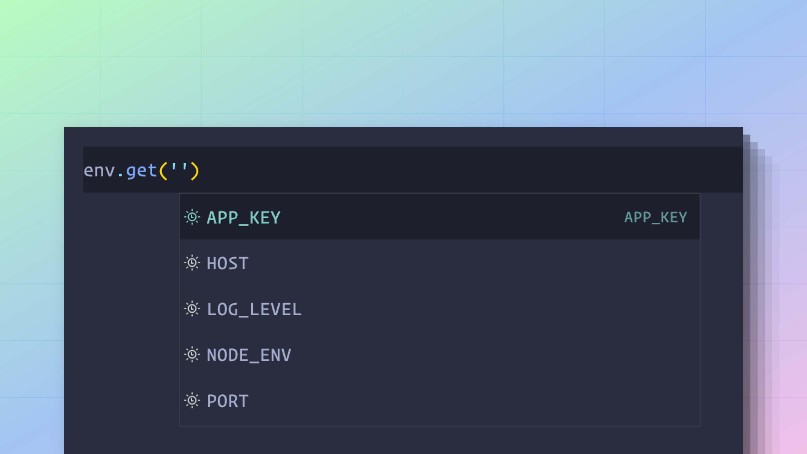

# 环境变量

环境变量用于在应用程序代码库之外存储机密信息，如数据库密码、应用程序密钥或API密钥。

此外，环境变量还可以用于为不同环境提供不同的配置。例如，您可能在测试期间使用内存邮件发送器，在开发期间使用SMTP邮件发送器，而在生产环境中使用第三方服务。

由于所有操作系统、部署平台和 CI/CD 管道都支持环境变量，它们已成为存储机密信息和特定于环境的配置的实际标准。

在本指南中，我们将学习如何在 AdonisJS 应用程序中利用环境变量。

## 读取环境变量

Node.js 通过[`process.env` 全局属性](https://nodejs.org/dist/latest-v8.x/docs/api/process.html#process_process_env) 原生地将所有环境变量作为一个对象暴露出来，您可以通过以下方式访问它们：

```dotenv
process.env.NODE_ENV
process.env.HOST
process.env.PORT
```

## 使用 AdonisJS 的 env 模块

虽然通过 `process.env` 对象读取环境变量在 Node.js 运行时中无需 AdonisJS 方面的任何设置，但在本文档的其余部分，我们将使用 AdonisJS 的 env 模块，原因如下：

- 能够从多个 `.env` 文件中存储和解析环境变量。
- 在应用程序启动时立即验证环境变量。
- 为经过验证的环境变量提供静态类型安全性。

env 模块在 `start/env.ts` 文件中实例化，您可以在应用程序中的其他地方按如下方式访问它。

```ts
import env from '#start/env'

env.get('NODE_ENV')
env.get('HOST')
env.get('PORT')

// Returns 3333 when PORT is undefined
env.get('PORT', 3333)
```

### 在 Edge 模板中共享 env 模块

如果您想在Edge模板中访问环境变量，那么您必须将 `env` 模块作为全局变量与 Edge 模板共享。

您可以在 `start` 目录中 [创建一个`view.ts`作为预加载文件](../concepts/adonisrc_file.md#preloads)，并在其中编写以下代码行。

```ts
// title: start/view.ts
import env from '#start/env'
import edge from 'edge.js'

edge.global('env', env)
```

## 验证环境变量

环境变量的验证规则是在 `start/env.ts` 文件中使用 `Env.create` 方法定义的。

当您首次导入此文件时，验证会自动执行。通常，`start/env.ts` 文件是由您项目中的某个配置文件导入的。如果不是，那么 AdonisJS 会在[启动应用程序之前](https://github.com/adonisjs/slim-starter-kit/blob/main/bin/server.ts#L34-L36)隐式地导入此文件。

`Env.create` 方法接受一个键值对作为验证模式。

- 键是环境变量的名称。
- 值是执行验证的函数。它可以是自定义的内联函数，或者是对预定义模式方法（如 `schema.string` 或 `schema.number` ）的引用。

```ts
import Env from '@adonisjs/core/env'

/**
 * App root is used to locate .env files inside
 * the project root.
 */
const APP_ROOT = new URL('../', import.meta.url)

export default await Env.create(APP_ROOT, {
  HOST: Env.schema.string({ format: 'host' }),
  PORT: Env.schema.number(),
  APP_KEY: Env.schema.string(),
  APP_NAME: Env.schema.string(),
  CACHE_VIEWS: Env.schema.boolean(),
  SESSION_DRIVER: Env.schema.string(),
  NODE_ENV: Env.schema.enum([
    'development',
    'production',
    'test'
  ] as const),
})
```

### 静态类型信息

相同的验证规则也用于推断静态类型信息。在使用 env 模块时，可以获取类型信息。




## 验证器模式API

### schema.string


`schema.string` 方法确保值是有效的字符串。空字符串无法通过验证，如果允许空字符串，则必须使用可选变体。

```ts
{
  APP_KEY: Env.schema.string()
}

// Mark APP_KEY to be optional
{
  APP_KEY: Env.schema.string.optional()
}
```

可以对字符串值的格式进行验证。以下是可用的格式列表。

#### host

验证该值是否为有效的URL或IP地址。

```ts
{
  HOST: Env.schema.string({ format: 'host' })
}
```

#### url

验证该值是否为有效的 URL。可选地，您可以通过允许没有 `protocol` 或 `tld` 的URL来放宽验证的严格性。

```ts
{
  S3_ENDPOINT: Env.schema.string({ format: 'url' })

  // Allow URLs without protocol
  S3_ENDPOINT: Env.schema.string({ format: 'url', protocol: false })

  // Allow URLs without tld
  S3_ENDPOINT: Env.schema.string({ format: 'url', tld: false })
}
```
  
#### email

验证该值是否为有效的电子邮件地址。

```ts
{
  SENDER_EMAIL: Env.schema.string({ format: 'email' })
}
```

### schema.boolean

`schema.boolean` 方法确保值是有效的布尔类型。空值无法通过验证，如果允许空值，则必须使用可选变体。

字符串表示形式 `'true'` 、 `'1'` 、 `'false'` 和 `'0'` 会被转换为布尔数据类型。

```ts
{
  CACHE_VIEWS: Env.schema.boolean()
}

// Mark it as optional
{
  CACHE_VIEWS: Env.schema.boolean.optional()
}
```

### schema.number

`schema.number` 方法确保值是有效的数字。数字值的字符串表示形式会被转换为数字数据类型。

```ts
{
  PORT: Env.schema.number()
}

// Mark it as optional
{
  PORT: Env.schema.number.optional()
}
```

### schema.enum

`schema.enum` 方法用于验证环境变量是否为预定义值之一。枚举选项可以指定为值的数组或 TypeScript 原生枚举类型。

```ts
{
  NODE_ENV: Env
    .schema
    .enum(['development', 'production'] as const)
}

// Mark it as optional
{
  NODE_ENV: Env
    .schema
    .enum
    .optional(['development', 'production'] as const)
}

// Using native enums
enum NODE_ENV {
  development = 'development',
  production = 'production'
}

{
  NODE_ENV: Env.schema.enum(NODE_ENV)
}
```

### 自定义函数

自定义函数可以执行模式 API 未涵盖的验证。

该函数接收环境变量的名称作为第一个参数，接收值作为第二个参数。它必须返回验证后的最终值。

```ts
{
  PORT: (name, value) => {
    if (!value) {
      throw new Error('Value for PORT is required')
    }
    
    if (isNaN(Number(value))) {
      throw new Error('Value for PORT must be a valid number')
    }

    return Number(value)
  }
}
```

## 定义环境变量

### 在开发环境中

在开发期间，环境变量是在 `.env` 文件中定义的。env 模块会在项目的根目录中查找此文件，并自动解析它（如果存在）。

```dotenv
// title: .env
PORT=3333
HOST=0.0.0.0
NODE_ENV=development
APP_KEY=sH2k88gojcp3PdAJiGDxof54kjtTXa3g
SESSION_DRIVER=cookie
CACHE_VIEWS=false
```

### 在生产环境中

建议在生产环境中使用您的部署平台来定义环境变量。大多数现代的部署平台都支持通过其 Web UI 来定义环境变量。

如果您的部署平台不提供定义环境变量的方式。您可以在项目根目录或生产服务器上的其他位置创建一个 `.env` 文件。

AdonisJS 会自动从项目根目录读取 `.env` 文件。但是，如果`.env` 文件存储在其他位置，则必须设置 `ENV_PATH` 变量。

```sh
# Attempts to read .env file from project root
node server.js

# Reads the .env file from the "/etc/secrets" directory
ENV_PATH=/etc/secrets node server.js
```

### 在测试期间

测试环境特有的环境变量必须在 `.env.test` 文件中定义。此文件中的值将覆盖 `.env` 文件中的值。

```dotenv
// title: .env
NODE_ENV=development
SESSION_DRIVER=cookie
ASSETS_DRIVER=vite
```

```dotenv
// title: .env.test
NODE_ENV=test
SESSION_DRIVER=memory
ASSETS_DRIVER=fake
```

```ts
// During tests
import env from '#start/env'

env.get('SESSION_DRIVER') // memory
```

## 所有其他 dot-env 文件

除了 `.env` 文件外，AdonisJS 还会处理以下点环境文件中的环境变量。因此，您可以根据需要选择性地创建这些文件。

排名最靠前的文件会覆盖排名较低的文件中的值。

<table>
    <thead>
        <tr>
            <th width="40px">排名</th>
            <th width="220px">文件名</th>
            <th>备注</th>
        </tr>
    </thead>
    <tbody>
        <tr>
            <td>1st</td>
            <td><code>.env.[NODE_ENV].local</code></td>
            <td>
              根据当前的 <code>NODE_ENV</code> 加载。例如，如果 <code>NODE_ENV</code> 设置为 <code>development</code> ，则会加载 <code>.env.development.local</code>文件。
            </td>
        </tr>
        <tr>
            <td>2nd</td>
            <td><code>.env.local</code></td>
            <td>在除 <code>test</code> 和 <code>testing</code> 环境之外的所有环境中加载</td>
        </tr>
        <tr>
            <td>3rd</td>
            <td><code>.env.[NODE_ENV]</code></td>
            <td>
              根据当前的 <code>NODE_ENV</code> 加载。例如，如果 <code>NODE_ENV</code> 设置为 <code>development</code>，则会加载 <code>.env.development</code> 文件。
            </td>
        </tr>
        <tr>
            <td>4th</td>
            <td><code>.env</code></td>
            <td>在所有环境中加载。如果在此文件中存储机密信息，应将其添加到 <code>.gitignore</code> 中。</td>
        </tr>
    </tbody>
</table>

## 在 dot-env 文件中使用变量

在 dot-env 文件中，您可以使用变量替换语法引用其他环境变量。

在以下示例中，我们根据 HOST 和 PORT 属性计算 APP_URL。

```dotenv
HOST=localhost
PORT=3333
// highlight-start
URL=$HOST:$PORT
// highlight-end
```

所有位于`$`符号之后的 **字母**、**数字** 以及 **下划线 (_)** 都用于构成变量名。如果变量名包含除下划线以外的特殊字符，则必须使用花括号 `{}` 将变量名括起来。

```dotenv
REDIS-USER=admin
REDIS-URL=localhost@${REDIS-USER}
```

### 转义 `$` 符号

若要将 `$` 符号用作值，必须对其进行转义，以防止发生变量替换。

```dotenv
PASSWORD=pa\$\$word
```
