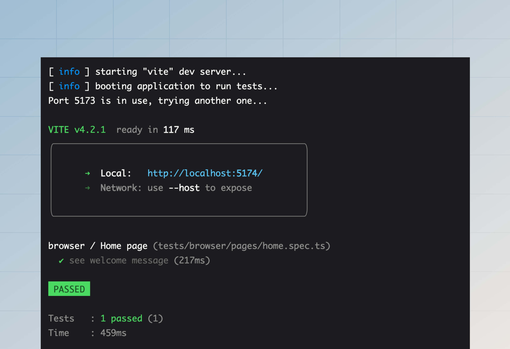

# 浏览器测试

浏览器测试在 Chrome、Firefox 或 Safari 等真实浏览器中执行。我们使用 [Playwright](https://playwright.dev/)（一种浏览器自动化工具）来以编程方式与网页交互。

Playwright 既是一个测试框架，也是一个库，它提供了用于与浏览器交互的 JavaScript API。我们 **不使用 Playwright 测试框架**，因为我们已经在使用 Japa，而在单个项目中使用多个测试框架只会导致混淆和配置臃肿。

相反，我们将使用 Japa 的 [Browser Client](https://japa.dev/docs/plugins/browser-client) 插件，该插件与 Playwright 集成良好，并提供了出色的测试体验。

## 设置

第一步是从 npm 包注册表中安装以下包。

:::codegroup

```sh
// title: npm
npm i -D playwright @japa/browser-client
```

:::

### 注册浏览器套件

让我们从在 `adonisrc.ts` 文件中为浏览器测试创建一个新的测试套件开始。浏览器套件的测试文件将存储在 `tests/browser` 目录中。

```ts
{
  tests: {
    suites: [
      // highlight-start
      {
        files: [
          'tests/browser/**/*.spec(.ts|.js)'
        ],
        name: 'browser',
        timeout: 300000
      }
      // highlight-end
    ]
  }
}
```

### 配置插件

在开始编写测试之前，您必须在 `tests/bootstrap.ts` 文件中注册 `browserClient` 插件。

```ts
import { browserClient } from '@japa/browser-client'

export const plugins: Config['plugins'] = [
  assert(),
  apiClient(),
  // highlight-start
  browserClient({
    runInSuites: ['browser']
  }),
  // highlight-end
  pluginAdonisJS(app)
]
```

## 基本示例

让我们创建一个示例测试，该测试将打开您的 AdonisJS 应用程序的主页，并验证页面内容。[`visit`](https://japa.dev/docs/plugins/browser-client#browser-api) 助手会打开一个新页面并访问一个 URL。返回值是 [page 对象](https://playwright.dev/docs/api/class-page)。

另请参阅：[断言方法列表](https://japa.dev/docs/plugins/browser-client#assertions)

```sh
node ace make:test pages/home --suite=browser
# DONE:    create tests/browser/pages/home.spec.ts
```

```ts
// title: tests/browser/pages/home.spec.ts
import { test } from '@japa/runner'

test.group('Home page', () => {
  test('see welcome message', async ({ visit }) => {
    const page = await visit('/')
    await page.assertTextContains('body', 'It works!')
  })
})
```

最后，让我们使用 `test` 命令运行上述测试。您可以使用 `--watch` 标志创建一个文件监视器，并在每次文件更改时重新运行测试。

```sh
node ace test browser
```



## 读取/写入 Cookie

在真实浏览器中测试时，Cookie 会在 [浏览器上下文](https://playwright.dev/docs/api/class-browsercontext) 的整个生命周期中持续存在。

Japa 会为每个测试创建一个新的浏览器上下文。因此，一个测试的 Cookie 不会泄漏到其他测试中。但是，单个测试内的多次页面访问会共享 Cookie，因为它们使用相同的 `browserContext`。

```ts
test.group('Home page', () => {
  test('see welcome message', async ({ visit, browserContext }) => {
    // highlight-start
    await browserContext.setCookie('username', 'virk')
    // highlight-end
    
    // "username" Cookie 将在请求期间发送
    const homePage = await visit('/')

    // "username" Cookie 也将在此请求期间发送
    const aboutPage = await visit('/about')
  })
})
```

类似地，可以使用 `browserContext.getCookie` 方法访问服务器设置的 Cookie。

```ts
import router from '@adonisjs/core/services/router'

router.get('/', async ({ response }) => {
  // highlight-start
  response.cookie('cartTotal', '100')
  // highlight-end

  return 'It works!'
})
```

```ts
test.group('Home page', () => {
  test('see welcome message', async ({ visit, browserContext }) => {
    const page = await visit('/')
    // highlight-start
    console.log(await browserContext.getCookie('cartTotal'))
    // highlight-end
  })
})
```

您可以使用以下方法读取/写入加密和普通的 Cookie。

```ts
// 写入
await browserContext.setEncryptedCookie('username', 'virk')
await browserContext.setPlainCookie('username', 'virk')

// 读取
await browserContext.getEncryptedCookie('cartTotal')
await browserContext.getPlainCookie('cartTotal')
```

## 填充会话存储

如果您使用 [`@adonisjs/session`](../basics/session.md) 包在应用程序中读取/写入会话数据，您可能还希望使用 `sessionBrowserClient` 插件在编写测试时填充会话存储。

### 设置

第一步是在 `tests/bootstrap.ts` 文件中注册插件。

```ts
// insert-start
import { sessionBrowserClient } from '@adonisjs/session/plugins/browser_client'
// insert-end

export const plugins: Config['plugins'] = [
  assert(),
  pluginAdonisJS(app),
  // insert-start
  sessionBrowserClient(app)
  // insert-end
]
```

然后，更新 `.env.test` 文件（如果缺少则创建一个），并将 `SESSION_DRIVER` 设置为 `memory`。

```dotenv
// title: .env.test
SESSION_DRIVER=memory
```

### 编写会话数据

您可以使用 `browserContext.setSession` 方法为当前的浏览器上下文定义会话数据。

所有使用相同浏览器上下文的页面访问都将能够访问相同的会话数据。但是，当浏览器或上下文关闭时，会话数据将被移除。

```ts
test('checkout with cart items', async ({ browserContext, visit }) => {
  // highlight-start
  await browserContext.setSession({
    cartItems: [
      {
        id: 1,
        name: 'South Indian Filter Press Coffee'
      },
      {
        id: 2,
        name: 'Cold Brew Bags',
      }
    ]
  })
  // highlight-end

  const page = await visit('/checkout')
})
```

与 `setSession` 方法类似，您可以使用 `browser.setFlashMessages` 方法来定义闪现消息。

```ts
/**
 * 定义闪现消息
 */
await browserContext.setFlashMessages({
  success: 'Post created successfully',
})

const page = await visit('/posts/1')

/**
 * 断言帖子页面在 ".alert-success" div 中显示闪现消息。
 */
await page.assertExists(page.locator(
  'div.alert-success',
  { hasText: 'Post created successfully' }
))
```

### 读取会话数据

您可以使用 `browserContext.getSession` 和 `browser.getFlashMessages` 方法读取会话存储中的数据。这些方法将返回与特定浏览器上下文实例关联的会话 ID 的所有数据。

```ts
const session = await browserContext.getSession()
const flashMessages = await browserContext.getFlashMessages()
```

## 用户认证

如果您在应用程序中使用 `@adonisjs/auth` 包来认证用户，您可以使用 `authBrowserClient` Japa 插件在对应用程序进行 HTTP 请求时认证用户。

第一步是在 `tests/bootstrap.ts` 文件中注册插件。

```ts
// title: tests/bootstrap.ts
// insert-start
import { authBrowserClient } from '@adonisjs/auth/plugins/browser_client'
// insert-end

export const plugins: Config['plugins'] = [
  assert(),
  pluginAdonisJS(app),
  // insert-start
  authBrowserClient(app)
  // insert-end
]
```

如果您使用的是基于会话的认证，请确保也设置会话插件。请参阅[填充会话存储 - 设置](#setup-1)。

就这样。现在，您可以使用 `loginAs` 方法登录用户。该方法接受用户对象作为唯一参数，并将用户标记为在当前浏览器上下文中已登录。

所有使用相同浏览器上下文的页面访问都将能够访问已登录的用户。但是，当浏览器或上下文关闭时，用户会话将被销毁。

```ts
import User from '#models/user'

test('get payments list', async ({ browserContext, visit }) => {
  // highlight-start
  const user = await User.create(payload)
  await browserContext.loginAs(user)
  // highlight-end

  const page = await visit('/dashboard')
})
```

`loginAs` 方法使用 `config/auth.ts` 文件中配置的默认守卫进行认证。但是，您可以使用 `withGuard` 方法指定自定义守卫。例如：

```ts
const user = await User.create(payload)
await browserContext
  .withGuard('admin')
  .loginAs(user)
```

## 路由辅助函数

您可以使用 TestContext 中的 `route` 辅助函数为路由创建 URL。使用路由辅助函数可以确保每当您更新路由时，无需返回并修复测试中的所有 URL。

`route` 辅助函数接受与全局模板方法 [route](../basics/routing.md#url-builder) 相同的参数集。

```ts
test('see list of users', async ({ visit, route }) => {
  const page = await visit(
    // highlight-start
    route('users.list')
    // highlight-end
  )
})
```
